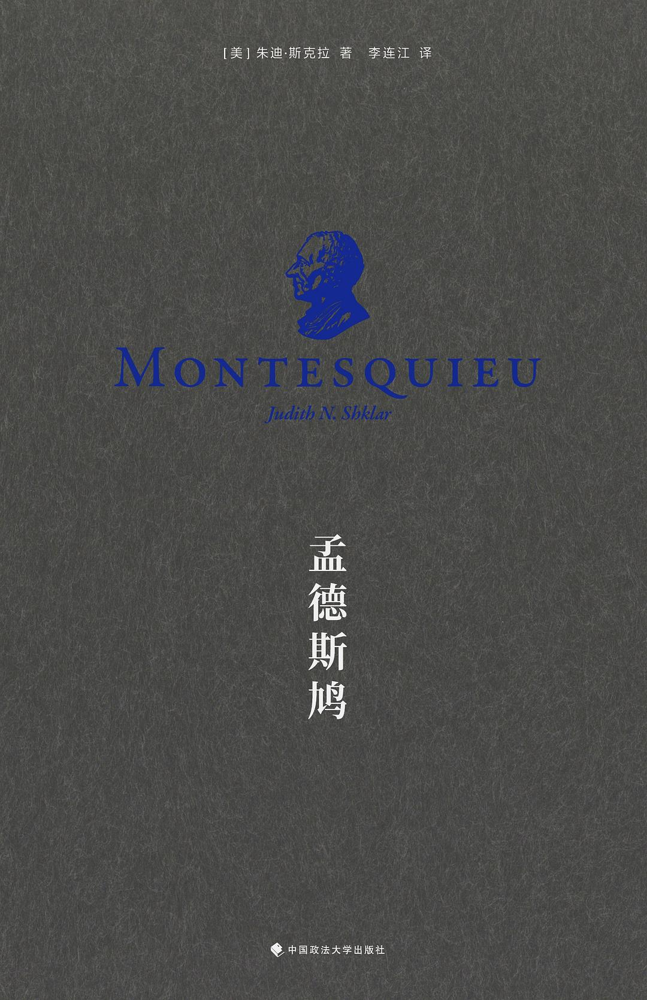

# 《孟德斯鸠》朱迪·斯克拉（美）

[TOC]

## 作者简介

> 朱迪·斯克拉（Judith N. Shklar, 1928 - 1992）
>
> 曾任美国哈佛大学政府系约翰·考勒斯教师。
>
> 她的著作还有《乌托邦之后》、《法制主义、人与公民》、《自由与独立》、《日常的恶行》等。

## 内容简介

## 人物关系

##### 夏尔 - 路易·德·赛贡达（孟德斯鸠男爵）

##### 雅各·德·赛贡达

> 夏尔 - 路易的父亲。

##### 玛丽 - 弗朗索瓦·德皮斯奈

> 夏尔 - 路易的母亲。
>
> 共有四个子女存活下来，两子两女。
>
> 夏尔 - 路易是长子。

##### 让娜·德·拉帝格

> 夏尔 - 路易的妻子

## 摘抄与笔记

### 第一章 一位博学之士的成长

### 第二章 《波斯人信札》：别人怎样看我们

### 第三章 哲理历史：罗马人的兴衰

### 第四章 《论法的精神》：约束与自由

### 第五章 《论法的精神》：必然与自由

### 第六章 宪法之父

### 后记