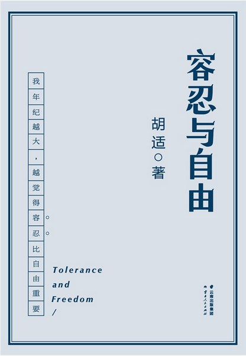

# 《容忍与自由》胡适

[TOC]

### 容忍与自由

我自己也有“年纪越大，越觉得容忍比自由还更重要”的感想。有时我竟觉得容忍是一切自由的根本，没有容忍，就没有自由。

我到今天还是一个无神论者，我不信有一个有意志的神，我也不信灵魂不朽的说法。但我的无神论与共产党的无神论有一点根本的不同。我能够容忍一切信仰有神的宗教，也能够容忍一切诚心信仰宗教的人。共产党自己信仰无神论，就要消灭一切有神的信仰，要禁绝一切信仰有神的宗教——这就是我五十年前幼稚而又狂妄的不容忍的态度了。

我自己觉得，这个国家，这个社会，这个世界，绝大多数人是信神的，居然能有这雅量，能容忍我的无神论，能容忍我这个不信神也不信灵魂不灭的人，能容忍我在国内和国外自由发表我的无神论的思想，从没有人因此用石头掷我，把我关在监狱里，或把我捆在柴堆上用火烧死。我在这个世界里居然享受了四十多年的容忍与自由。