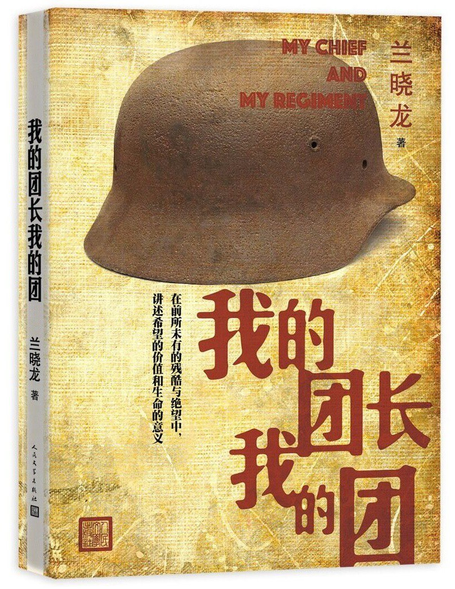

# 我的团长我的团（兰晓龙）

[TOC]

## 内容概述

## 目录

## 人物介绍

龙文章

> 三十五岁。自称是赶尸世家，能与鬼魂对话。他对战争有着独特的敏锐嗅觉。
>
> 经历南天门战役，险些断送整个炮灰团后，对战争及国民党的派系之争彻底失望。

孟烦了

> 二十七八岁。知识分子家庭出身。通达英语的高才生。总爱用损毒的语言、堕落的行径掩饰自己。在做炮灰的日子中迷失了原本的愿望与热情，在日本人的刺刀下有了一条作为中日战争证据的残腿，但也从此丢失了魂魄。

## 摘抄

杜运燮《赠友》

### 角色的初次出场

#### 孟烦了

> 坦克以一种人散步时的速度漫不经心地离开，日军小队虽仍拉着散兵线，却也和散步一样漫不经心，其中一个日本兵经过我身边时，用刺刀捅进我的大腿，绞动了一下。
>
> 我死了，我就不动。
>
> 他们走了，消失于焦炽的地平线上，既然焦土上已经没有站立的中国人了。
>
> 整个阵地都在烧着。白磷和汽油在燃烧，武器和弹药在燃烧，尸体在燃烧，连泥土和弹坑都在燃烧，而我睁开眼时，只看见在我身边燃烧的那个燃烧瓶。它已经碎了，燃液在土地上流淌，流过我身边，把我没能划燃的火柴一根根点燃。我呆呆地看着那些在火海中依次蓬然亮起的小小火光，它们不属于我，从来就没属于过。
>
> 永远是这样。一群你看不上，也看不上你的粗人一再挫折你的希望，最后他们和你的希望一起成为泡影流沙。在经历四年败战和几千公里的溃退之后，我的连队终于全军覆没。

> 我叫孟烦了，二十四岁，今国军某支所谓新编师之一员，中尉副连长。家父大概是烦恼很多的样子，以致要用我的名字把烦恼了却。烦恼从不了却，倒连累我从小心事重，心事多，而且像刚才死的那些大老粗们，总是“烦啦，烦啦”地叫着，有的是不认字，有的是图省事。
>
> 现在他们都死啦，人要往好处看，我想我终于摆脱了“烦啦”这该死的名字。
>
> 一个多月后，我走在滇边一个叫禅达的小镇上，忽然听得一个山西佬在我身后鬼叫：“——烦啦！——烦啦！”
>
> 我站住，因为没能摆脱“烦啦”这个该死的名字而受惊、失望到狰狞。为了表示抗议我缓慢地顾盼，其实我知道叫我的人是谁。我现在给人一种迟钝和呆滞的假象，其实我是这时代为数不多的反应奇快甚至过快的人类之一。

#### 康丫

> 叫我的人自身后重拍我的肩膀。山西佬康丫的军装扣子已经全部掉光了，以致始终得腾出一只手掩着衣衫下摆，这是为了身份而非风化——一个兵敞着也就算啦，但康丫是准尉，他是官儿。
>
> 康丫，有着还算清晰的外表和绝对粗糙的心灵，生活对他来说是理应心不在焉对待的东西，在这样的世界里他的甘为弱智是一种自保。他最大的特点是无论何时何地，永远在问任何人要任何东西，要不到无所谓，要到了便当喜财。他甚至上茅坑都不带厕纸，宁可蹲在那儿找人要，他总是厚颜无耻地在这样做，因为他心里模糊地明白：生活不会让他这样的人占到更大便宜。
>
> 康丫说什么，是我睡着了也能猜到的：“有吃的没？”
>
> 我白眼向人，望了一望，慢慢把康丫的肘子抬到嘴边张口，康丫败不馁地拿开：“有烟的没？”

#### 不辣

> 一摊人踞坐于巷子中心的路上，完全堵塞了交通。用“摊”来计算，是因为他们大多数坐都没得坐相。他们的激愤通常始于口水也终于口水，一口浓郁湘南腔的不辣是其中最大的一泡口水。他油滑时亦显得激愤，激愤时亦带着油滑，他浑浑噩噩但永远带种纯真的愤怒，他还有种来自乡野的原始的生命力，凭这个，虽然只是区区一个上等兵，他却时常在一群听天由命的兵油子里占到先机。

#### 迷龙 / 羊蛋子 / 李乌拉

> 白山黑水之人迷龙，上等兵，他有一张竹躺椅，顺便守候着他身后的仓库和一个“童叟无欺，概不赊欠”的牌子。他正和他的亲信羊蛋子在躺椅边的一张小凳上掷骰子赌博。赌注很好笑，谁输了谁就被对方在屁股上踢一记。迷龙占尽便宜，十有七八是他赢，而羊蛋子就算赢了也只敢轻轻来一下，迷龙则不怎么喜欢节省自己的力气。从外表无法看出迷龙只是个上等兵，因为这货穿了件并不合体的校官服，为图凉快又撕去了袖子，下身是条轻纱纺绸裤子，加上裸露的虬结的肌肉，看起来像个刚干了一大票的土匪暴发户。他赢舒服了就给自己扇两扇子，顺便吃一片羊蛋子早给他切好的西瓜。少尉李乌拉在旁边怯怯欲言，但总被迷龙例无虚发地向后一肘子捅回。

#### 郝兽医

> 郝兽医在为蛇屁股检查他胳膊上的一块溃烂，他是望闻问切加摸心脏看舌头，主观加客观地乱用，可以说他用尽一切在无器械情况下能用的诊疗手段，但没有任何治疗手段。老头子五十六岁，或者说，才五十六岁，就被我们不客气地称为“老头子”和“老不死”。他是我们中唯一的医生，没人知道他算医官还是算医兵。做老百姓时匆匆赶往战场救助伤兵，然后被伤兵裹挟进溃军大潮，套件军装，便成军医。他的医术很怪，三分之一中医加三分之一西医，加三分之一久病成医。他从没治好过任何人，所以我们叫他兽医。

#### 蛇屁股

> 蛇屁股后腰上横挎着把菜刀，脖子上挂了根绳子，绳子上串着蛇牙，牙的主人早进他肚子啦，而这玩意儿被他当驱邪之物留了下来。广东佬蛇屁股为人所知的事情只有三件：一、他打过淞沪之战，老兵；二、附近能找到的蛇已经被他吃光了；三、他把菜刀放在身上，因为他爱做饭，因为放别地儿就会被摸走，因为没饭可做的时候菜刀可用于自卫。

#### 豆饼

> 豆饼瞪着眼睛被几个人围在中间，他在做实验小白鼠。他从要麻手上的一把草中择出一些，一根根嚼，千万别以为他无聊，他真指望那能充饥，只是从表情上看，他也在怀疑人能把这当成食物。这是个十九岁的河南佬，五年前他下地割麦子，被某连长征作马弁，开始生平第一次远足，至今没能结束。他所到的任何地方都是从没到过的地方。

#### 要麻

> 要麻在观察，表情随着豆饼表情的变幻而变幻。尽管他仍坚挺着给豆饼以鼓励的表情，但如果不是那两位旁观者抱着一种“反正不是我吃”的心态，仍在给他手上加入新的草本植物，他可能早已中断了这项研究。川兵要麻和湘军不辣是磕头换帖的弟兄，但要麻远比不辣来得谨慎，所以不辣在外边叫嚣而他在这里吃草，所以不是他吃而是豆饼吃，所以他是下士而不辣是上等兵。

#### 阿译

> 我转过头看到了我们的组长阿译，他在那个角落里浇他养的一棵花树。在这样的境况中那样细微地浇一棵花树近乎有病，但阿译就在做这件事。阿译，我们中间军装最整洁的一个，如果我是落落寡合，他则干脆是自闭。他浇着那棵花树，甚至看着一只像他一样和这片灰头土脸格格不入的蝴蝶，似乎那是他全部的世界。忧伤在他身上并不让人同情，因为他的忧伤让人觉得抑郁——他看起来与这世界格格不入，这种格格不入并非说他是一种简单的娘娘腔，而是一种更致命的永远无法投入，却又永远飞蛾扑火般的投入。少校阿译，来自锦绣的江南之地，三青团员，某军官特训团成员。别被名牌吓到，他是这儿唯一的校官没错，可也是这里唯一连战场都没上过的青瓜蛋子。听着远远的炮声，一路从老家退到这里。现在他信奉和恪守的那些都已经碎散了，他试图用他并不存在的能力和个人魅力让我们重建信仰。

### 白菜猪肉炖粉条

仁安羌之战后，破旧的军车在街上驶过，喇叭声在做着鼓舞士气的宣读。

> 杜绝热情和永不言信，是我这种人为落拓人生掘就的散兵坑。可阿译没打过仗，只会把自己扔在射界之内，永远神经质的紧张。生活没给他好事，他闭上了眼，偏还说一片光明，因此他的命运非常清晰，就是永远面对我们的否定。

> 我跟着，眼角的侧光里扫见阿译守着他的木牌，守着一个在瞬间便变了质的梦幻。
>
> 小上海佬还在那儿念叨：“……因为二十五年前，今天，我出生了。我今天二十五……”
>
> 没人听，那嘀咕就我听见了。我从他身边拖过时拍了拍他，拍出他满腹委屈和痛苦的根源，他悲苦甚至悲愤地抱怨：“猪肉，真的不好弄啊。”
>
> 关我什么事呢？我拖着腿跟上郝兽医。别树太高的理想，那叫给自己挖坑。今天阿译提出了不切实际的白菜猪肉炖粉条，立刻摔进坑里，还大头朝下——可是那关我什么事呢？
>
> 阿译只好守着他的木牌发呆——那是命中注定。

#### 阿译的父亲

> 郝兽医“嗯哪”了声，只管继续忙他的，到我都出了棚却冷不丁来了一句：“阿译还有只表。”
>
> 我就乐了：“他爹留给他的。他爹在日占区做顺民，去上班，被日本人当靶子来着。卡——踏——啪——勾。”
>
> 我弹了下自己的额头，那表示日制六点五毫米子弹在人头上找到的进口。阿译他爹从脚踏车上飞跌而下，那发日本子弹在他后脑上找到了出口。我拍了下自己的后脑，嘲笑着：“没招谁，没惹谁，就是有个日本兵想试试刚擦完的枪。”

> 因为我俩都罔视对方的痛苦，所以我俩都选择难堪的沉默。我想打晕他把表抢过来，可我们都是军官，是有为青年，还算是朋友，似乎昨天还很有知识和抱负。可我只想着我的腿，而阿译只想证明自己，他的自尊已经成为愚蠢。

#### 小太爷的忏悔

> 没有用的，那帮混蛋“好啊好啊”地继续跺着脚和吹口哨，今晚的油腻让他们比哪天都更有活力，这让我的忏悔完全成了炫耀，事实上呢——我也不知道。

> 我在那样的一个丑态中被康丫玩弄我的脸皮。就是这样，你造了很多孽，但总被原谅，偶尔你会愤怒，你想这样也行？但就是这样也行。最后你只好想有人比你造了更多的孽，比如说那些让我们一无所有投入战场的官员——你已经屈服了，就这么简单。

### 整编

> 郝兽医并不打算被我们这堆杂牌军推倒：“大概就是要补充兵源，要拿咱们补充兵源就准是那边伤亡惨重，伤亡惨重就准是没有吵吵的那么大胜。敌军几个月就玩儿完啦，这种话鬼子说我们也说，都信不得的。”
>
> 我们沉默。老头子从下午想到现在，说出来的也是最理智的，正因如此我们沉默。
>
> “就是整一堆炮灰呗！沤出了蘑菇的木头脑袋疙瘩才去！”迷龙鬼叫，他的话伴随着动静巨大的起床。他离开了我们，一路踢凳子推桌子地发泄怒气。
>
> 我们愣着，看着彼此，这回我们之中没有人昏昏欲睡或者嬉笑怒骂。我们无法像迷龙那样干脆地做决定，因为从一九三一年流亡入关，他已经失望了十一年。我们苍老但不像他那么苍老。远征军是我们的骄傲，即算炮灰也是装备精良的炮灰。做炮灰还是沤蘑菇，这是个严重的问题。

> 阿译泥雕木塑了一会儿，说：“我要去。我要带着军队从缅甸打回上海。我要给家父报仇。”然后他蹲在地上哭泣。我们沉默。我觉得他的进军路线有点儿匪夷所思，而说话也颇为不自量力，主要是我不想沉默，这样的沉默如同刀割，于是我便打破沉默，刻薄地说：“进军路线有点儿问题，往缅甸打下去很快就下海了，不是上海。”

> “……我是一定不会去的。我死过一次了。”我宣布，然后离开。只是我尽力在掩饰我那条拖着的左腿，而他们看着我掩饰我的左腿。之前，我一向拖得极为自在，并且以苦作乐地想，小太爷拖出了自己的风格。

> 我看着山丘，看着墓碑，看着坟坑，看着郝兽医在坑里耸动的瘦削的肩胛。我看着死人，我看着活人。
>
> 我终于得到了我要的那个机会，靠卑鄙，不靠蠢货们的热血和真诚。

