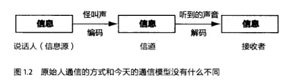

# 《数学之美》吴军

## 作者简介

## 内容概述

## 读书笔记

### 第1章 文字和语言 vs 数字和信息

> **文字是出现**在远古“信息爆炸”导致人们的头脑装不下这些信息的时候，那么**数字的出现**则是在人们的财产多到需要数一数才搞清楚有多少的时候。

#### 本章重点

- 通信的原理和信息传播的模型
- 多义性和利用上下文消除歧义性
- 多语对照文本，语料库和机器翻译
- 编码和最短编码
- 校验位
- 解码的规则，语法

###### 信息

###### “亚尼的死者之书”（Book of The Death）

###### 消除聚类带来的歧义

> 文字按照意思来聚类，最终会带来一些**歧义性**，也就是说有时弄不清一个多义字在特定环境下它到底表示其中的哪个含义。
>
> 而解决这个问题的方法，过去的先生和今天的学者没有什么不同，都是依靠**上下文**。有了上下文，大多数情况下多义字的**去除歧义（Disambiguation）**可以做到。当然， 总有个别做不到的时候，这就导致了学者们对某段话理解上的不同。中国古代学者对儒家经典的注释和正义，其实都是在按照自己的理解做消除歧义性的工作。今天的情况也类似，对上下文建立的概率模型再好，也有失灵的时候。这些是语言从产生伊始就固有的特点。

###### 翻译

> 随着文明的融合与冲突，不同文明下的人们需要进行交流，或者说通信，那么翻译的需求便产生了。
>
> 翻译这件事之所以能达成，仅仅是因为**不同的文字系统在记录信息上的能力是等价的。**
>
> 进一步讲，**文字只是信息的载体，而非信息本身。**

###### 罗塞塔（Rosetta）石碑

> 1798年，拿破仑的远征军来到埃及，随军有上百名学者。一天，一个叫皮埃尔·弗朗索瓦·布沙尔（Pierre-Francois Bouchard）的中尉在一个叫罗塞塔（Rosetta）的地方发现了一块破碎的古埃及石碑，上面有三种文字：**埃及象形文字**、**埃及的拼音文字**和**古希腊文**。

> **启示：**
>
> - 信息的冗余是信息安全的保障。
>   - 罗塞塔石碑上的内容是同一信息重复三次，因此只要有一份内容完好保留下来，原有的信息就不会丢失，这对信道编码有指导意义。
> - 语言的数据，我们称之为语料，尤其是双语或者多语的对照语料对翻译至关重要，它是我们从事机器翻译研究的基础。
>
> 因此，今天很多翻译软件和服务都叫做 “罗塞塔”，例如Google的机器翻译。

###### 《从一到无穷大》乔治·伽莫夫（美）

> 两个酋长要比一比谁说的数字大，一个酋长想了想，先说了“三”，第二个酋长想了半天，说你赢了。

###### 玛雅文明

> 二十进制。
>
> 玛雅人的一个世纪，称为**太阳纪**，是四百年。
>
> 2012年正好是目前这个太阳纪的最后一年。

###### 不同位数数字的表示

> **中国人：**
>
> - 十
> - 百
> - 千
> - 万
> - 亿
> - 兆
>
> **罗马人：**
>
> - I - 个
> - V - 5
> - X - 10
> - L - 50
> - C - 100
> - D - 500
> - M - 1000
>
> 它们都是用不同的符号代表不同的数字概念。
>
> 它们分别制定了解码的规则：
>
> - 中国解码的规则是乘法
> - 罗马解码的规则是加减法

###### 阿拉伯数字

> 古印度人发明，由阿拉伯人传入欧洲。
>
> 阿拉伯数字或者说印度数字的革命性不仅在于它的简洁有效，而且标志着数字和文字的分离。
>
> 这在客观上让自然语言的研究和数学在几千年里没有重复的轨迹，而且越走越远。

###### 象形文字到拼音文字

> 当人类第二个文明的中心古巴比伦在两河流域的美索不达米亚建立的时候，一种新的文字 —— **楔形文字**诞生了。
>
> **拼音文字**由腓尼基人从以古巴比伦为中心的美索不达米亚带到地中海东岸的叙利亚，他们将楔形字母简化成22个字母，并传给了希腊人的祖先。在今后的几个世纪里，伴随着马其顿人以及几个世纪后的罗马人的扩张，这些只需要几十个字母的语言成为了欧亚非大陆语言体系的主体，因此，今天我们把所有西方的拼音字母称为**罗马式的语言（Roman Languages）**。

###### 古文与白话

> 古文（书面语）非常简介，但是非常难懂，而同时期的口语却和今天的白话差别不大，语句较长但是易懂。
>
> 这种现象非常符合今天信息科学的一些基本原理：
>
> - 在通信时，如果信道较宽，信息不必压缩就可以直接传递；
>   - 两个人讲话说得快，是一个宽信道。
> - 如果信道很窄，信息在传递前需要尽可能地压缩，然后在接收端进行解压缩。
>   - 书写来的慢，是一个窄信道。

###### 《圣经》中的校验码

> 虽然做事认真的犹太人要求在抄写《圣经》时，要虔诚并且打起十二分精神，尤其是每写到“上帝”这个词时要去洗手祈祷，但是抄写错误还是难以避免。
>
> 于是犹太人发明了一种类似于我们今天计算机和通信中校验码的方法：
>
> - 他们把每一个希伯来字母对应于一个数字，这样每行文字加起来便得到一个特殊的数字，这个数字便成为了这一行的校验码。同样，对于每一列也是这样处理。
>
> 当犹太学者抄完一页《圣经》时，他们需要把每一行的文字加起来，看看新的校验码是否和原文的相同，然后对每一页进行同样的处理。
>
> 如果这一页每一行和每一列的校验码和原文完全相同，说明这一页的抄写无误。
>
> 如果某行的校验码和原文中的对应不上，则说明这一行至少有一个抄写错误。

###### 语法

> 如果说从字母到词的**构词法（Morphology）**是词的编码规则，那么**语法**则是语言的编码和解码规则。
>
> 不过，相比较而言，词可以被认为是有限而且封闭的集合，而语言则是无限和开放的集合。
>
> 从数学上讲，对于前者可以有完备的编解码规则，而后者则不具备这个特性。
>
> 因此，任何语言都有语法规则覆盖不到的地方，这些例外或者说不精确性，让我们的语言丰富多彩。

###### 到底是语言对，还是语法对？

> 前者坚持从真实的语句文本（称为语料）出发，而后者坚持从规则出发。
>
> 经过三四十年的争论，最后实践是检验真理的唯一标准，自然语言处理的成就最终宣布了前者的获胜。

### 第2章 自然语言处理 —— 从规则到统计

#### 本章重点

- 图灵测试
- 自然语言处理的发展阶段
- 早期对自然语言处理的理解
- 从基于规则到基于统计的转变

###### 语言的数学本质

> 语言出现的目的是为了人类之间的通信。
>
> 字母、文字和数字实际上是信息编码的不同单位。任何一种语言都是一种编码的方式，而语言的语法规则是编解码的算法。
>
> 我们把一个要表达的意思，通过某种语言的一句话表达出来，就是用这种语言的编码方式对头脑中的信息做了一次编码，编码的结果就是一串文字。
>
> 而如果对方懂得这门语言，他或者她就可以用这门语言的解码方式获得说话人要表达的信息。

###### 机器能否懂得自然语言呢？

> 这里面涉及到两个认知方面的问题：
>
> - 计算机是否能处理自然语言？
> - 如果能，那么它处理自然语言的方法是否和人类一样？

###### 图灵测试（Turing Test）

> 1950年他在《思想》（Mind）杂志上发表了一篇题为：“计算机的机器和智能”的论文。
>
> 他提出了一种来验证机器是否有智能的方法：让人和机器进行交流，如果人无法判断自己交流的对象是人还是机器时，就说明这个机器有智能了。

###### 自然语言处理的发展阶段

> - 早期的20多年 —— 20世纪50年代到70年代
>   - 科学家们走弯路的阶段
>   - 全世界的科学家对计算机处理自然语言的认识都被自己局限在人类学习语言的方式上，也就是说，用电脑模拟人脑，这20多年的成果近乎为零。
> - 20世纪70年代至今
>   - 一些自然语言处理的先驱重新认识这个问题，找到了基于数学模型和统计的方法，自然语言处理进入第二个阶段。

######  达特茅斯夏季人工智能研究会议 —— 1956年夏天

> - 约翰·麦卡锡（John McCarthy）
> - 马文·明斯基（Marvin Minsky）
> - 罗切斯特（Nathaniel Rochester）
> - 香农
> - 赫伯特·西蒙（Herbert Simon）
> - 艾伦·纽维尔（Alan Newell）
> - 还有四位年轻的科学家
>
> 他们讨论当时计算机科学尚未解决的问题，包括人工智能、自然语言处理和神经网络等。

###### 鸟飞派

> 即看看鸟是怎样飞的，就能模仿鸟造出飞机，而不需要了解空气动力学。
>
> 那时候学术界对人工智能和自然语言理解的普遍认识是这样的：要让机器完成翻译或者语言识别这样只有人类才能做的事情，就必须先让计算机理解自然语言，而做到这一点就必须让计算机有类似我们人类这样的智能。

###### 早期对自然语言处理的理解

> 在20世纪60年代，摆在科学家面前的问题是怎样才能理解自然语言。
>
> 当时普遍的认识是首先要做好两件事，即**分析语句**和**获取语义**。
>
> 20世纪60年代，基于**乔姆斯基形式语言**的编译器技术得到了很大的发展，计算机高级程序语言都可以概括成上下文无关的问法，这是一个在算法上可以在**多项式时间内解决的问题（Polynomial Problem）**。
>
> 那时，科学家们设计了一些非常简单的自然语句的**语法分析器（Parser）**，可以分析词汇表为百十来个词、同时长度为个位数的简单语句。

###### 自然语言的文法和计算机高级程序语言的文法

> 描述自然语言的文法和计算机高级程序语言的文法不同。
>
> 自然语言在演变过程中，产生了词义和上下文相关的特性。因此，它的文法是比较复杂的**上下文有关文法（Context Dependent Grammar）**，而程序语言是我们认为设计的，为了便于计算机解码的**上下文无关文法（Context Independent Grammar）**。
>
> 理解两者的计算量不可同日而语。
>
> 对于上下文无关文法，算法复杂度基本上是语句长度的二次方，而对于上下文有关文法，算法复杂度基本上是语句长度的六次方。
>
> 也就是说，长度同为10的程序语言的语句和自然语言的语句，计算机对它们进行语法分析的计算量，后者是前者的一万倍。

###### 从规则到统计

> 在20世纪70年代，基于规则的句法分析很快就走到了尽头。而对于语义的处理则遇到了更大的麻烦。
>
> 自然语言中词的多义性很难用规则来描述，而是严重依赖于上下文，甚至是常识。

###### 弗里德里克·贾里尼克（Frederick Jelinek）

> 1970年以后**统计语言学**的出现使得自然语言处理重获新生，并取得了今天的非凡成就。推动这个技术路线转变的关键人物就是弗里德里克·贾里尼克（Frederick Jelinek）和他领导的IBM华生实验室（T. J. Watson）。
>
> 采用基于统计的方法，IBM将当时的语音识别率从70%提升到90%，同时语音识别的规模从几百单词上升到几万单词。

###### 持续15年的争议

> 上个世纪70年代，**基于统计的方法**的核心模型是**通信系统**加**隐含马尔科夫模型**。
>
> - 这个系统的输入和输出都是一维的符号序列，而且保持原有的次序。
> - 而在句法分析中，输入的是一维的句子，而输出的是二维的分析树。
> - 在机器翻译中，虽然输出的依然是一维的句子，但是次序会有很大的变化。
>
> 1988年，IBM的彼得·布朗（Peter Brown）等人提出了基于统计的机器翻译方法，框架是对的，但是效果很差，因为当时既没有足够的统计数据，也没有足够强大的模型来解决不同语言语序颠倒的问题。
>
> 过去的25年里，随着计算能力的提高和数据量的不断增加，过去看似不可能通过统计模型完成的任务，渐渐都变得可能了，包括很复杂的句法Fenix。
>
> 到了上个世纪90年代末期，大家发现通过统计得到的句法规则甚至比语言学家总结的更有说服力。
>
> 2005年后，随着Google基于统计方法的翻译系统全面超过基于规则方法的`SysTran`翻译系统，基于规则方法固守的最后一个堡垒被拔掉了。

### 第3章 统计语言模型

> 自然语言从它产生开始，逐渐演变成一种上下文相关的信息表达和传递的方式，因此让计算机处理自然语言，一个基本的问题就是为自然语言这种上下文相关的特性建立数学模型。
>
> 这个数学模型就是在自然语言处理中常说的**统计语言模型（Statistical Language Model）**，它是今天所有自然语言处理的基础，并且广泛应用于机器翻译、语音识别、印刷体或手写体识别、拼音纠错、汉字输入和文献查询。

###### 贾里尼克的统计模型

> p55

