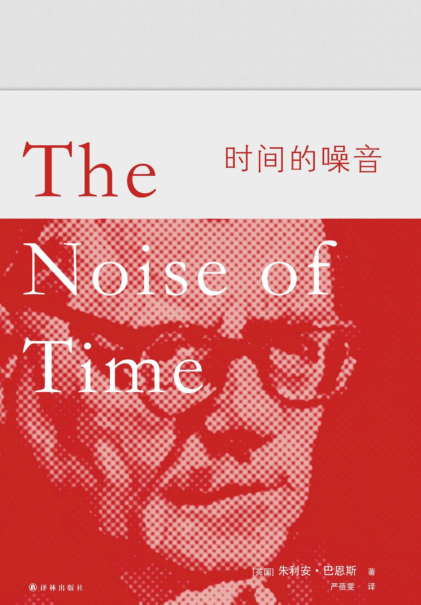

# 《时间的噪音》朱利安·巴恩斯（英）

## 作者简介

> 朱利安·巴恩斯（Julian Barnes，1946年1月19日－），后现代主义文学作家。1946年生于英格兰中部的列斯特，1968年牛津大学毕业，曾参与《牛津辞典增补本》的编纂工作，著有长篇小说九部和侦探小说四部，曾四度获得布克奖提名（1984、1998、2005、2011），并在2011年以《终结感》获得布克奖，以1984年《福楼拜的鹦鹉》最为脍炙人口。是获得梅迪西文学奖（《福楼拜的鹦鹉》）和费米娜奖（《尚待商榷的爱情》   ）的惟一英国作家。

—— 摘自<a href="[https://baike.baidu.com/item/%E6%9C%B1%E5%88%A9%E5%AE%89%C2%B7%E5%B7%B4%E6%81%A9%E6%96%AF](https://baike.baidu.com/item/朱利安·巴恩斯)">百度百科</a>

## 内容概述

> 

## 人物关系

##### 德米特里·德米特里耶维奇·肖斯塔科维奇

主人翁

##### 妮塔·瓦尔扎尔

妻子

##### 加琳娜（加莉娅）

女儿

##### 尤尔根森

房子的勤杂工

##### 图哈切夫斯基元帅

朋友

##### 塔尼娅（塔季扬娜·格列文科）

初恋

##### 马鲁霞

姐姐

##### 索菲亚·瓦西里耶芙娜

母亲

##### 特米特里·勃列斯拉夫维奇

父亲

##### 罗扎利娅

差点与之结婚的妓女

## 摘抄与笔记

### 引子

> 一个听，一个记，一个饮。 ——谚语

### 第一章 在电梯旁

> 站在这里，他原以为可以控制自己的思绪。但是，夜晚，孤身一人，好像是思绪在控制他。**是的，人无法逃脱命运，就像诗人向我们保证过的那样。也无法逃脱思绪。**

> 命运。这是一个大词，意味着某些事你无能为力。当生活告诉你，“就这样”，你只好点头，称之为命运。就这样，他命中注定被称为德米特里·德米特里耶维奇。对此无能为力。自然，他不记得自己的命名仪式了，但他没有理由怀疑这件事的真实性。

> 名字有什么关系？他出生在圣彼得堡，在彼得格勒成长，在列宁格列长大成人。名字又有什么关系？

> 最近，他的生活好像稳定了下来。他从未如此直接地感受过事物的这一面。他感受过强烈的情感，但从来不能娴熟地将它们表达出来。即使在球赛中，他也很少叫嚷，或像别人那样失控；对球员技巧或是技巧不足的安静讲解让他心满意足。有人会认为，这是列宁格勒人典型的闷罐子风格；但除此之外，或心底里，他知道自己是一个羞怯而焦虑的人。和女人在一起时，当他抛开羞涩后，他会在殷勤可笑和犹豫沮丧间摇摆不定。就好像他总是踩错点。
>
> 但即使如此，他的生活最终还是步入正轨，有了正确的节拍。只是现在又开始动荡不安。动荡不安：这只是一个委婉说法。

> 时世越艰难，双手越贪婪。

> 哈图切夫斯基让他安全。安全了很多年。直到有一天，他看见汗珠从元帅的发际线滚落下来。一块大大的白手帕在飘动，在轻拍，然后他知道，他不再安全了。

> 有时候，他怀疑，他所有的焦虑不是从父亲去世时开始的。但他情愿不这么想，因为那几乎是在怪德米特里·勃列斯拉夫维奇了。所以，这么说更接近真相：他所有的焦虑在那一刻翻倍了。多少次，他点头同意那些严肃沉重的鼓励话：“现在你是这个家的男人了。”他们的期待，以及一种他也许无法承担的责任感，把他吓坏了。而他的健康总是很脆弱：他太熟悉医生叩诊的手，那些轻敲与聆听，那探针，那手术刀，那疗养院。他一直在等待这种被许诺的男子气概能让他成长。但他知道，他太容易分心；而且太任性，不能一直保持坚定。

> 强大让他忍不住去对抗；不那么强大又让他忍不住要逃避。

> 他九岁时被放在琴键前。那正是世界对他来说日渐清晰的时候。或者说是一部分的世界，不管怎样，足够支撑起他的人生。

> 弄明白钢琴和音乐很容易，至少比弄明白其他事情容易。

> 他勤学苦练，因为勤学苦练很容易。

> 作曲家被期待像矿工一样提高产量，他的音乐被期待温暖人心，就像矿工的煤温暖身体一样。官僚们在评估音乐的生产，就像他们评估其他种类的生产一样；有标准产品，也有出了偏差的次品。

> 他不是一个有信仰的人，但他受过洗礼，有时，路过某座开放的教堂，他会为他的家庭点上一支蜡烛。他也很了解《圣经》。因此他很熟悉罪的概念；还有它的公共机制。罪行，对罪行的供认不讳，牧师对事情的审判，祈祷，忏悔，宽恕。尽管有时，罪恶过于巨大，连牧师也无法宽恕。是的，他明白这些规则和礼仪，不管教堂怎么称呼他们。

> 他作曲时，总能确切知道该做什么；对音乐需要什么，他总能做出正确决断。....但离开了音乐......情况就很不同了，他会变得神经质，脑子会糊涂，有时候会做出一个愚蠢的决定，只是为了把事情解决掉，而不是因为知道自己想要什么。可能他在艺术上的早熟，意味着他躲开了那些帮助普通人长大成人的岁月。但不管是什么原因，他在生活的实践中很笨拙，而这，无疑包括感情的实践。于是，在阿纳帕，除了爱的狂热以及性带来的眩晕和自足，他发现自己进入了一个完全崭新的世界，这个世界充满着不必要的沉默、误解的暗示和心不在焉的计划。

> 他们在阿纳帕的时光是首田园牧歌，但根据定义，牧歌只有结束了才被称为牧歌。他发现了爱情；但他也开始发现，爱情远不是让他“成为他自己”，远不是像康乃馨精油那样，擦遍他全身，而是会让他难为情，让他为难。他不在塔尼娅身边时，显然最爱她。而当他们在一起时，双方对彼此都有期待，这份期待，他既无法确认，也无法回应。

> 早些时候，她曾温柔地告诉他，她被他吸引，是因为他的单纯和坦诚。但如果这没能让她爱他像他爱她那么多，那么，他希望自己既不单纯也不坦诚。倒不是说他感到自己单纯和坦诚。它们听上去是设计好要把他关在盒子里的词汇。

> 他发现自己在反省真诚的问题。个人的真诚，艺术的真诚。如果它们是真诚的，它们是如何相连的。这种美德每个人究竟拥有多少，又能够保存多久。他告诉朋友们，如果他否定《姆钦斯克县的麦克白夫人》，那么他们就会断定，他已经丧失了真诚。

> 他把自己想象成一个拥有强烈感情的人，只是缺乏表达它们的技巧。但那只会让自己太轻易地得到宽恕；这还是不真诚。事实上，他是个神经病。他认为他知道自己要什么，他得到了他想要的，他不再需要它了，它离开了他，他又想让它回来。

> 他知道，在他心里，他理想中的爱情是什么。它在莫泊桑的短篇小说里被完整地表达过了，故事是关于一位年轻的警备司令，他驻扎在地中海沿岸的一个要塞小镇。对，那地方就叫昂蒂布。总之，这位军官常常在镇子郊外的树林里散步，在那里常常撞见本地商人帕里斯先生的妻子。自然，他爱上了她。这个女人反复拒绝他的殷勤，直到有一天，她让他知道，她丈夫要外出，一晚上不回来。一场幽会被安排好了，但到了最后一分钟，这位妻子收到一封电报：他丈夫的生意提前谈完了，晚上就回来。为爱疯狂的警备司令，捏造了一起紧急军事事件，下令关闭城门，到第二天早上再开。回家的丈夫被刺刀挡在外面，只好在昂蒂布火车站候车室凑合了一晚。如此一来，那位军官就可以享受几小时的情爱了。
>
> 诚然，他无法想象自己管理一座要塞，更不用说寂静的黑海之滨温泉小镇上一道摇摇欲坠的土耳其城门了。但道理是一样的。你应该这样去爱，没有恐惧，没有障碍，不用去想明天。然后，之后没有遗憾。

> 他是个内向的男人，总是被外向的女人吸引。这是否就是麻烦的一部分？

> 他点燃了另一支烟。在艺术和爱情之间，在压迫着和被压迫者之间，总有香烟。

> 在一部小说中，他生活中所有的焦虑，他的强大和软弱的混合，他歇斯底里的潜质，都会被一个爱的漩涡裹挟，引向婚姻的喜悦和平静。但生活中有许多令人失望的东西，其中之一就是它从来都不是小说，既不是莫泊桑的小说，也不是其他人的。好吧，有可能是果戈理的一个讽刺短篇。

> 艺术家们出于他们的自由意志，而不是政治上的引导，将帮助他们的人类伙伴发展和完善他们的灵魂。
>
> 有什么不可以？这是艺术家最古老的梦想。或者，就像他现在想的，是艺术家最古老的幻想。因为政治家官僚很快就来控制这个工程了，过滤掉其中的自由、想象、复杂和微妙，没有这些，艺术只会变得愚蠢。这里有两个主要的问题。首先是，许多人并不想让自己的灵魂被人设计，对不起，多谢。他们对自己来到这个世界时的灵魂的样子很满意；当你要去引导他们时，他们会反抗。来这场自由的露天音乐会吧，同志们。噢，我们真的认为你该来。是的，当然这是自愿的，但如果你没露面，可能就犯了错误......
>
> 第二个关于人类灵魂工程师的问题更本质一些。那就是：谁来做工程师的工程师？

> 他记得在哈尔科夫一座公园的一场露天音乐会。他的《第一交响曲》让附近的狗都狂吠起来。群众大笑，乐队演奏得更大声，所有的狗叫得更响了，观众也笑得更大声了。现在， 他的音乐让更大的狗叫了起来。历史在重复自己：第一次是闹剧，第二次是悲剧。

> “人无法逃避命运。”就这样，他将在三十岁死去。肯定比佩尔戈莱西年长，但要比舒伯特年轻。就此而言，和普希金差不多。他的名字和他的音乐会被抹去。他不仅将不复存在，他从来就没存在过。他是一个错误，被迅速纠正；是照片中的一张脸，但会在第二次印刷时消失。

> 未来会决定未来将决定的事情。

> 我们对未来有太多的期待，希望它能和现在抗争。

> 刚开始向他发出威胁时，他告诉朋友：“就算他们砍掉我的双手，我也要口衔钢笔继续创作。”这是蔑视的言辞，想要以此支撑每个人的灵魂，包括他自己的。

> 在斯大林的俄国，没有口衔钢笔创作的作曲家。从此以后，只有两种类型的作曲家：战战兢兢活着的和已经死掉的。

> 理论是清楚的、明了的、可以理解的。生活是混乱的、毫无意义的。

> 他们没注意到最后乐章里的尖锐讽刺，那是对胜利的嘲笑。他们只听到了胜利本身，听到了对苏联音乐和苏联音乐理论、对斯大林体制之光下的生命的一些忠诚背书。他用最强音和主大调结束了交响乐。如果他用弱音和小调结束，会怎样？如果这样，一条或者几条生命也许会被终结。是的，“世上只有荒谬”。

### 第二章 在飞机上

> “只有好伏特加，极品伏特加 —— 没有什么坏伏特加。”从莫斯科到列宁格勒，从阿尔汉格尔斯克到古比雪夫，这都是至理名言。但现在他知道了，还有一种美国伏特加，例行添加了水果香味，掺杂着柠檬、冰块和奎宁水，伏特加的味道在鸡尾酒中被掩盖了。因此，也许确实有坏伏特加这种东西。

> 恐惧：制造恐惧的人知道些什么？他们知道它起作用了，甚至知道它是怎么起作用的，但不知道它感觉起来如何。“狼说不出羊的恐惧”，正如他们所说。

> 屠格涅夫不合他的文学趣味：太文明，不够荒诞。他更喜欢普希金和契诃夫，最好的是果戈理。不过就算是屠格涅夫，缺点再多，他也有一种真正的俄罗斯悲观主义。事实上，他明白，成为俄国人，就算成为悲观的人。他还写过这样的话，不管你怎么刷洗一个俄罗斯人，他依然是俄罗斯人。这是那些人永远不会理解的。他们想成为人类灵魂的工程师；但俄罗斯人，缺点再多，也不是机器。所以他们忙活的并不真的是设计工程，而是揉搓。揉搓，揉搓，揉搓，让我们洗掉这种旧属性，在上面涂上闪亮的崭新属性。但这永远行不通 —— 涂料一抹上，就簌簌往下掉。

> 在空洞的官方调调中，他放下讲稿停了下来，抬起头，环视会议厅，用无助的声音说：“我总是觉得，当我真诚地、带着真情实感写曲子时，我的音乐是不可能‘反对’人民的，因为毕竟......从某个微小的程度上来说，我本人也是人民的一员。

> 有几年，他总是作同样的新年致辞。因为这个国家的其他三百六十四天，每天都不得不聆听全力的疯狂调子，坚持说一切都是为了追求最美好的可能世界里的最美好的事物，天堂已经被创造出来，或者马上就要被创造出来了，只需要多砍掉一些树木，多飞溅几百万片木片，多枪毙几十万个破坏者。更幸福的时代就要到来 ——除非他们已经拥有。在第三百六十五天，他会举起杯子，用最庄严的声音说：“让我们干杯 —— 祝一切好得不能再好了！”

> 当说真话变得不再可能 —— 因为这会导致立刻死亡 —— 它不得不披上伪装。在犹太人的民族音乐里，绝望被伪装成舞蹈。因此，真话的伪装是讽刺。

> 在一个理想的世界里，年轻人不该是冷嘲者。在那个年纪，冷嘲会有碍成长，影响想象力。最好是在欣悦开放的思想状态下开始人生，信任别人，为人乐观，对人对事坦诚相待。然后，对人对事有了更深的理解后，可以培养一种讽刺感。人类生活的自然进程就是从乐观到悲观；讽刺感有助于调和悲观，产生平衡和和谐。
>
> 但这不是一个理想的世界，所以讽刺以各种突然而奇怪的方式生长出来。一夜之间，就像蘑菇；灾难性的，如同癌症。

> 你砍树，碎屑就飞溅：这是建设者喜欢说的话。但要是你放下斧子，发现整个伐木场砍得只剩下碎屑了呢？

> 描述人类幻觉的破碎，还有比《李尔王》更伟大的作品吗？不，这还不够确切：不是粉碎，因为那暗示只是一次性的严重危机。事实上，人类幻觉的常见情形，是它们破碎了，萎谢了。这是一个漫长而乏味的过程，就像牙疼深抵灵魂。你可以拔掉牙齿，疼痛消失。可是幻觉即使死了，还会继续在我们体内腐烂发臭。我们无法逃脱它们的味道和气息。我们总是随身携带。

> 怎么可能不爱莎士比亚呢？毕竟，莎士比亚热爱音乐。他的戏剧充满了音乐，即使是悲剧。那一刻，李尔王从疯狂中醒来，听到的是音乐......而在《威尼斯商人》中，莎士比亚说，一个不喜欢音乐的人，不值得信任；这样的人不吝行事卑鄙，甚至敢于谋杀和叛国。因此，暴君们当然都憎恨音乐，不管他们怎么想方设法做出喜欢的样子。尽管他们更憎恨的是诗歌。他希望列宁格勒诗人朗诵会时他曾在场，阿赫马托娃登上舞台，所有观众本能地站起来为她喝彩。这动作令斯大林怒气冲冲地质问：“谁组织人们站起来的？”但是，比诗歌更甚，暴君们憎恨、害怕戏院。莎士比亚，举起了人性的镜子，谁受得了看到自己的身影？因此，《哈姆雷特》被禁演了很长时间；斯大林厌恶这部戏，跟厌恶《麦克白》一样多。
>
> 不过，尽管如此，尽管莎士比亚对暴君的描绘 —— 他们站在齐膝深的鲜血里 —— 无人匹敌，他还是有些天真。因为他的魔鬼还有疑惑，有噩梦，有良心的折磨，有愧疚。他们看见他们杀死的人的魂灵，在他们眼前浮现。但在真实的生活中，在真实的恐怖之下，有什么愧疚？有什么噩梦？这都是多愁善感，是虚假的乐观主义，是奢望世界会成为我们想让它成为的样子，而不是它本来的模样。那些砍伐树木让木屑飞溅的人，那些在“大房子”的办公桌后抽别洛莫尔的人，那些签署命令和拨打电话的人，合上档案便是结束了一条人命：他们怎么可能做噩梦，又何曾看见那些死者的魂灵浮现出来斥责他们。

> 伊利夫和彼得罗夫这样写道：“热爱苏联还不够。它还得爱你。”他本人从没被爱过。他来自错误的家庭：那座可疑城市的自由主义知识分子家庭。对苏联来说，纯粹性很重要。而且，他有虚荣心，或者说是愚蠢，注意到并记住了政府昨天说过的话常常和今天说的自相矛盾。他想孑然独处，只和音乐、家庭和朋友在一起：这是最简单的欲望，然而完全无法实现。他们想建设他和其他所有人。他们想让他就像白海运河的奴隶劳改犯那样改造自己。他们需要”一个乐观的肖斯塔科维奇“。即使这世界的鲜血和泥浆已经漫及脖子，还是期待你的脸上保持微笑。但艺术家的本性是悲观的、神经质的。因此，他们不想让你成为一个艺术家。但他们已经有了那么多不是艺术家的艺术家！正如契诃夫所说：”如果他们供应咖啡，别指望里面会有啤酒。“

> 德米特里·德米特里耶维奇以前有一个职务是在音乐学院当教授，曾帮着组织学生进行考试。他和主考官坐在一条巨大的横幅下，上面写着：艺术属于人民。因为他自己对政治理论的理解不是很深厚，所以大部分时间都保持沉默，直到有一天上级批评他没有参与感。于是，当下一个学生走进来，主考官朝着他这位下级同事严厉地点头时，他只好问她一个他能想出来的最简单的问题。
>
> “告诉我，艺术属于谁？”
>
> 学生太慌了，没领会他的暗示，尽管他歪着脑袋、眼珠子往上翻，她还是没能找到答案所在的位置。
>
> 在他看来，她表现不错，后来，当他偶尔在音乐学院的走廊或楼梯上看见她时，会努力给她一个鼓励的微笑。尽管，鉴于她没能领会那个如此明显的暗示，她也许会以为，他的微笑，就像他怪异的翻白眼和晃脑袋，是这位著名作曲家无法控制的脸部抽搐。然而，每次和她擦肩而过时，那个问题就会在他脑海里回响：“告诉我，艺术属于谁？”

> 艺术属于所有人，也不属于任何人。艺术属于所有时代，也不属于任何时代。艺术属于那些创造它的人，也属于那些享受它的人。艺术是历史的低语，能在时间的噪音之上被听闻。艺术不是为了艺术而生：它是为了人民而生。但，是哪种人民？谁来定义？他总是认为自己的艺术的反贵族的。他是不是，如他的批评者坚持认为的，在为全世界的资产阶级精英创作？不是。他是不是，如他的批评者希望他做的那样，在为顿巴斯的矿工们创作，他们疲惫地下班，需要一杯抚慰提神的酒？也不是。他为每个人创作，他又不为任何人创作。他为那些能欣赏他音乐的人创作，不管他们是什么社会出身。他为那些耳朵能听见的人创作。因此，他知道，所有对艺术的真正定义都是间接的，而所有不真实的定义都会将艺术归结为某种特定功能。

> 这就是为什么他不能自杀：因为他们会偷走他的故事重新写过。他必须掌握自己的人生故事，哪怕只是以自己无望而歇斯底里的方式。

> 他敬佩那些站出来跟全力说出真相的人。他敬佩他们的勇气和正直。他有时甚至妒忌他们；不过这很复杂，因为这妒忌里有一部分是妒忌他们的死，他们脱离了生的苦恼。......但这些英雄，这些烈士的死，通常会给予两边满足 —— 一边是发出命令的暴君，一边是那些观望的国家，他们想要表达同情的时候又能自觉优越 —— 他们没有孤独死去。他们的英雄主义，会让他们周围的许多东西被摧毁。因此，这事并不简单，即便一目了然。

> “生活不是在田野上漫步”：这也是帕斯捷尔纳克关于哈姆雷特之诗的最后一行。前一行是：“我是孤独的；我的周遭溺没在谎言中。”

### 第三章 在汽车里

> 

### 后记

### 我的英雄是一个懦夫 —— 恺蒂专访巴恩斯

## 相关名词

###### [德米特里·德米特里耶维奇·肖斯塔科维奇]([https://zh.wikipedia.org/wiki/%E5%BE%B7%E7%B1%B3%E7%89%B9%E9%87%8C%C2%B7%E5%BE%B7%E7%B1%B3%E7%89%B9%E9%87%8C%E8%80%B6%E7%BB%B4%E5%A5%87%C2%B7%E8%82%96%E6%96%AF%E5%A1%94%E7%A7%91%E7%BB%B4%E5%A5%87](https://zh.wikipedia.org/wiki/德米特里·德米特里耶维奇·肖斯塔科维奇))

###### [布尔什维克]([https://baike.baidu.com/item/%E5%B8%83%E5%B0%94%E4%BB%80%E7%BB%B4%E5%85%8B%E5%85%9A/1900165?fromtitle=%E5%B8%83%E5%B0%94%E4%BB%80%E7%BB%B4%E5%85%8B&fromid=534742&fr=aladdin](https://baike.baidu.com/item/布尔什维克党/1900165?fromtitle=布尔什维克&fromid=534742&fr=aladdin))

###### [姆钦斯克县的麦克白夫人]([https://baike.baidu.com/item/%E5%A7%86%E9%92%A6%E6%96%AF%E5%85%8B%E5%8E%BF%E7%9A%84%E9%BA%A6%E5%85%8B%E7%99%BD%E5%A4%AB%E4%BA%BA](https://baike.baidu.com/item/姆钦斯克县的麦克白夫人))