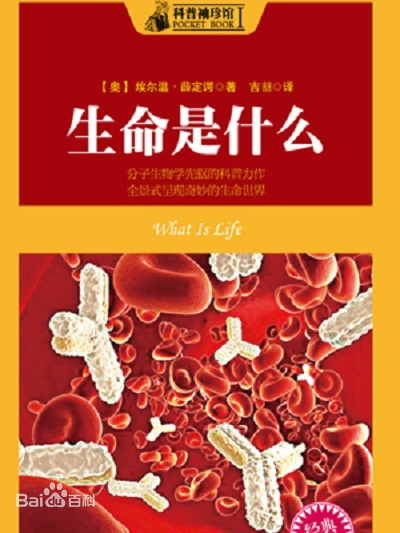

# 《生命是什么》埃尔温·薛定谔

## 作者简介

**埃尔温·薛定谔**（Erwin Schrödinger，1887年8月12日—1961年1月4日），男，奥地利物理学家，量子力学奠基人之一，发展了分子生物学。维也纳大学哲学博士。苏黎世大学、柏林大学和格拉茨大学教授。在都柏林高级研究所理论物理学研究组中工作17年。因发展了原子理论，和狄拉克（Paul Dirac）共获1933年诺贝尔物理学奖。又于1937年荣获马克斯·普朗克奖章。

 物理学方面，在德布罗意物质波理论的基础上，建立了波动力学。由他所建立的薛定谔方程是量子力学中描述微观粒子运动状态的基本定律，它在量子力学中的地位大致相似于牛顿运动定律在经典力学中的地位。 提出薛定谔猫思想实验，试图证明量子力学在宏观条件下的不完备性。亦研究有关热学的统计理论问题。在哲学上，确信主体与客体是不可分割的。主要著作有《波动力学四讲》《统计热力学》《生命是什么？——活细胞的物理面貌》等。

## 内容简介

## 摘抄与笔记

### 第1章 序言

### 第2章 经典物理学家走近，这个主题

### 第3章 遗传机制

### 第4章 突变

### 第5章 量子力学的证据

### 第6章 对德尔勃吕克模型的讨论和检验

### 第7章 有序、无序和熵

### 第8章 生命是以物理学定律，为基础的吗

### 第9章 意识的物质基础

### 第10章 了解未来

### 第11章 客观性原则

### 第12章 算术悖论：意识的单一性

### 第13章 科学与宗教

### 第14章 感知的奥秘