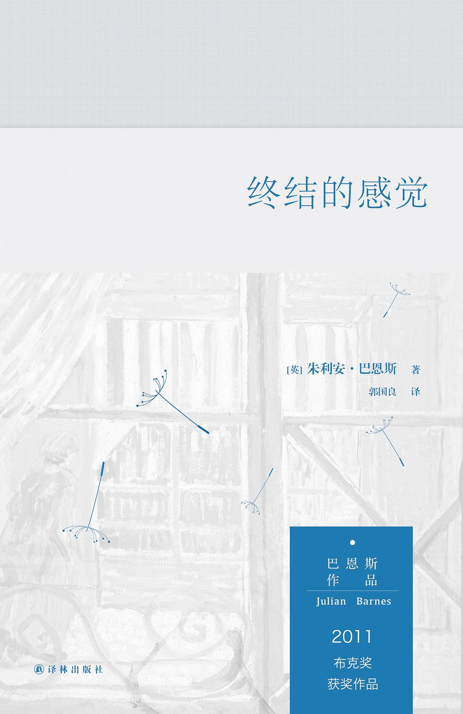

# 《终结的感觉》朱利安·巴恩斯（英）

[TOC]

## 作者简介

> 朱利安·巴恩斯（Julian Barnes，1946年1月19日－），后现代主义文学作家。1946年生于英格兰中部的列斯特，1968年牛津大学毕业，曾参与《牛津辞典增补本》的编纂工作，著有长篇小说九部和侦探小说四部，曾四度获得布克奖提名（1984、1998、2005、2011），并在2011年以《终结感》获得布克奖，以1984年《福楼拜的鹦鹉》最为脍炙人口。是获得梅迪西文学奖（《福楼拜的鹦鹉》）和费米娜奖（《尚待商榷的爱情》   ）的惟一英国作家。

—— 摘自<a href="[https://baike.baidu.com/item/%E6%9C%B1%E5%88%A9%E5%AE%89%C2%B7%E5%B7%B4%E6%81%A9%E6%96%AF](https://baike.baidu.com/item/朱利安·巴恩斯)">百度百科</a>

## 内容概述

> 

## 人物关系

##### 托尼·韦伯特斯

男主角。

##### 艾德里安·芬恩

托尼中学时期的朋友

##### 维罗妮卡

托尼大学时的女朋友

##### 亚里克斯

托尼中学时的铁三角之一。

##### 科林

托尼中学时的铁三角之一。

##### 维罗妮卡·玛丽·伊丽莎白·福特

托尼的女朋友。

##### 玛格丽特

托尼的妻子，后离婚。

##### 苏茜

托尼与玛格丽特的女儿。

## 摘抄与笔记

### 回忆中的“新乐音”

> 不变的自我往往是美好的虚构。

> 其实自我受制于时间，通过回忆不断生成变化。如果一个人在不同的时候对发生在自己身上的事理解有所不同，那么回忆在发挥关键作用。

> 《终结的感觉》的叙述者就是不断在记忆深处中挖掘，冲破自己不知不觉间设置的障碍，最终听到了“纯洁的新乐音”。他跳脱出狭隘的自我，开始从他人的角度来观察、分析自己的历史，并且变得具有同情心。

> 这是他的自白：“我觉得我有一种生存的本能，一种自我保护的本能。也许这就是维罗妮卡所说的胆小吧，但我称之为温和。

> 时间先安顿我们，继而又迷惑我们。我们以为自己是在慢慢成熟，而其实我们只是安然无恙而已。我们以为自己很有担当，其实我们十分懦弱。我们所谓的务实，充其量不过是逃避现实，绝非直面以对。”

> 历史既不是胜利者的谎言，也不是失败者的自欺欺人，也许，“不可靠的记忆与不充分的材料相遇所产生的确定性就是历史。”

> 在讨论谁该为第一次世界大战爆发负责的时候，艾德里安说：“这整个追究责任的行为难道不就是一种逃避吗？我们责备某个个人，目的就是为其余人开脱罪责。或者呢，我们归咎于历史进程，为一个个个体免责。抑或将一切归咎于一片混沌，结果也是一样。在我看来，似乎有——或者曾经有——一条个体责任链，所有责任不可或缺，但此链并非无限之长，不然谁都可以轻率归咎于他人。当然，我想要追究责任，这或许只是反映了我本人的心境，并非对事件的合理分析。”

> “我们编造出故事来掩盖我们不知道或者不能接受的事实；我们保留一些事情真相，围绕这些事实编织新的故事。我们的恐慌和痛苦只有靠安慰性的编造功夫缓解；我们称之为历史。”

> 克莫德认为，对终局的预测反过来会影响到对初始和中间阶段的理解，或者说，故事的结尾使得前面发生的一切具有意义。

### 第一部

> 这最后一幕我没有真正见过，但是，你最后所记得的，并不总是与你曾经目睹的完全一样。

> 我们生活在时间中 —— 时间掌握并塑造我们 —— 但我感觉自己从未很好地理解时间。当然，我并不是指那些关于时光弯曲和折回的种种理论，或者可能存在于他处的平行世界。不，我说的是一般的日常时间，钟表用滴答、滴答之声来告诉我们正在悠然逝去的时间。还有什么比秒钟更貌似真实的吗？然后，只需寥寥的愉悦或痛苦，我们就能体会到时间的韧性。某些情感会促其加速，而另一些情感又会让它放缓脚步；偶尔，它好像不知去向 —— 直到最后时刻，它真的猝然失踪，一去不复返。

> “好吧，芬恩，你来回答。这段历史你熟悉吗？”
> 这位新来的男生坐在前面一排，在我的左边。对马歇尔弱智的回答，他没什么明显的反应。
> “恐怕谈不上熟悉吧，老师。但是，要形容任何历史事件——譬如说，即使是第一次世界大战的爆发——我们唯一真正可说的一句话就是：‘事情发生了’。”

> 我还记得另一个细节：我们三个人，作为同盟的象征，经常把手表表面戴在手腕内侧。这当然是一番做作，但也许另有深意。它让时间感觉像是一件很个人，甚至是很私密的东西。我们希望艾德里安注意到这一举动，并跟着效仿；但他没有这样做。

> 我还记得另一个细节：我们三个人，作为同盟的象征，经常把手表表面戴在手腕内侧。这当然是一番做作，但也许另有深意。它让时间感觉像是一件很个人，甚至是很私密的东西。我们希望艾德里安注意到这一举动，并跟着效仿；但他没有这样做。

> 他给我们的印象是，他是一个信念坚定的人。其实我们也是——只不过我们纯粹地相信自己的事情，而不相信我们被决定的事情。这就是我们持有的净化怀疑论。

> 那时，人们还远未开始使用“单亲家庭”这一词语，只说“破碎的家庭”。在我们认识的人中，艾德里安是唯一一个来自单亲家庭的孩子。按理说，这本应给他足够的理由愤世嫉俗，但不知道为什么，他并没有怨天尤人。

> 此前，亚历克斯已被视为我们中的哲学家。他读过我们另外两个都没读过的东西，比如，他也许会冷不丁地宣言：“无言之所，唯余沉默。”我和科林会静静思考一会，然后咧嘴一笑，继续谈笑风生。但是艾德里安的到来把亚历克斯拉下了马 —— 或者，更确切地说，给了我们选择另一个哲学家的机会。

> 那时候，我们大多是绝对主义者，只喜欢对与错，褒与贬，有罪与无辜 —— 或者，就马歇尔而言，动荡不安与非常动荡不安。我们喜欢有输赢结局的游戏，不喜欢平局。

> 对于科林这种试图否定一切的论断，亨特只是轻轻地点点头，仿佛病态的怀疑是青春期一种自然而然的副产品，长大了也就渐渐好了。老师和家长老是说他们也曾年轻过，所以他们的话颇具权威，这样的念叨很烦人。他们坚持说，这不过是阶段性的罢了，你总会长大成熟的；生活会教会你什么叫现实，什么叫务实。但是那时候我们拒绝承认他们曾经有一丁点儿像我们，而且我们坚信自己能够把握人生 —— 还有真理、道德和艺术 —— 跟这些已经妥协的年长者比起来，我们看得更清。

> “呃，某种意义上说，我无法知道我到底什么不知道。从哲学上说，这是不言而喻的。”他也稍稍停顿了一下，让我们再次纳闷他是在隐隐嘲讽呢，还是在故作严肃。“说实在的，这整个追究责任的行为难道不就是一种逃避吗？我们责备某个人，目的就是为其余人开脱罪责。或者呢，我们归咎于历史进程，为一个个个体免责。抑或将一切归咎于一片混沌，结果也是一样。在我看来，似乎有 —— 或者曾经有 —— 一条个体责任链，所有责任不可或缺，但此链并非无限之长，不然谁都可以轻率归咎于他人。当然，我想要追究责任，这或许只是反映了我本人的心境，并非对事件的合理分析。**先生，这不就是历史的核心问题之一吗？这是个主观阐释与客观阐释的问题，即我们必须了解历史学家的历史才能理解此刻摆放在我们面前的历史版本。**”

> “加缪说，自杀才是唯一的真正的哲学问题。”
>
> “除了伦理，政治，审美，现实性还有其他一切。”亚历克斯的反驳甚是尖锐。
>
> “唯一的、真正的问题。根本的问题，其他一切问题均依赖于此。”

> 对罗布森自杀事件做了详尽分析之后，我们断定，他的自杀只有在算术的意义上才具有哲学意蕴：他即将在世界总人口数上再增添一位，所以才觉得保持地球人口总数恒常不变是他的道德义务。但是，在其他所有方面，我们认为罗布森都让我们倍感失望，也辜负了严肃思考。他的行为无关哲学，简直是自我放纵，且不具艺术美感：换言之，是极端错误的。

> 从阅读伟大的文学作品中我们得知，爱情总是与痛苦密不可分，只要有一个暗藏的甚或可想而知的前景，即爱情也许已悠然来临，那么我们就会心甘情愿在体验痛苦。
>
> 这就是我们的另一大恐惧：人生不会和文学一样。看看我们的父母吧——他们难道是文学的产物吗？他们充其量不过是旁观者和看客，是社会背景的一部分，烘托那些真正重要的大事件。

> 文学的旨趣所在：爱，性，道德，友谊，幸福，痛苦，背叛，通奸，善与恶，英雄与恶棍，有罪与无辜，野心，权势，正义，革命，战争，父与子，母与女，个人与社会，成败，谋杀，自尽，死亡，上帝。

> 真正的文学关涉人的心理、情感和社会现实，通过主人公的行为和反思得以展现；小说描写的是人物性格在时间长河中的发展历程。

> “我不知道。他们说我长大了就会明白的。”
>
> “大人们老是这么承诺。那为什么不能现在就解释呢？我往往这样反问。”其实我从来没说过这话。而且，据我所知，我家没有任何秘密，这让我感觉无比羞愧和失望。

> “也许，我们可以从一个看似简单的问题开始，即，什么是历史？你有何想法，韦伯斯特？”
>
> “历史就是胜利者的谎言。”我几乎不假思索地答道。
>
> “是啊，我就担心你会这么说呢。呃，只要你记住，它也是失败者的自欺欺人。”
>
> “芬恩，你呢？”
>
> “‘不可靠的记忆与不充分的材料相遇所产生的确定性就是历史。”
>
> “确实是这样吗？你从哪里找到这句话的？”
>
> “拉格朗日，先生。帕特里克·拉格朗日。是个法国人。”

> “但什么都无法弥补罗布森本人的证言，先生。”
>
> “从某一方面来说，确实不能。但是，同样地，历史学家也需要用怀疑的态度来对待某位亲历者对事件的说辞。通常，那些着眼于未来的说辞最值得怀疑。”

> 记得第一学期的时候，我在一次聚会上喝了点酒，有点感伤，这时一个女孩路过，同情地问我是否感觉还好，我没想到自己的回答竟然是，“我觉得自己是个狂躁的抑郁者”，因为在当时，这样的说法听起来比“我觉得有点伤感”更有个性。结果她却回答，“又是这套”，然后立刻转身离去，这时我才意识到，自己的这一回答不仅不能让我从快乐的人群中脱颖而出，反而成了世界上最烂的泡妞用语。

> 她看着我，一条秀眉挑起，越过眼镜框。她只比我大五个月，但有时让人觉得差了五年。

> 起初，她问了几件事，其中一个问题就是我为什么要把手表戴在手腕内侧。我无法明确说出理由，所以只好把手表转了个圈，让表面朝外，就像普通成年人那样。

> 我在别处读到过这样的话，如果你想让别人认真听你说话，不要提高音量，而应该降低音量：这才是唤起注意的真正有效的方法。

> 我思考了片刻，或者说试图思考。但我眼前只能浮现出一潭死水的画面，上面漂着厚重的泡沫，蚊蝇丛生。我意识到自己实在不擅长讨论此类问题。

> “那你觉得我们在一起合适吗？”
>
> “你总是问我一些问题，好像你知道答案或者好像你知道你想要什么答案。那你干嘛不告诉我答案到底是什么，然后我会告诉你我是否也是这么想的？”

> 维罗妮卡没有吻我的嘴唇，只是吻了吻我的嘴角，然后离开。在我的印象里，这应该就是我们关系破裂的开始。或者说我故意这样想以便让事情看上去正是如此，好把分手的责任推给她？

> 我觉得自己实在无法确切描述当时那一幕带给我的震撼。这并非像龙卷风和地震那样 —— 大自然狂暴凶猛，极具毁灭性，让我们搞清楚自己几斤几两。眼前的情景更加令人不安，因为这一切看上去让人有一种隐隐的不妙之感，仿佛有人在按压宇宙中一根小小的杠杆，而自然和时间就在此时此刻被一起掀翻。在漆黑的午夜时分目睹这样的奇观，让这一切显得更加神秘，更加超凡脱俗。

> 我暗自思忖：两个人相处都这么久了，我甚至都没有见过她的乳房。我已经摸过，但是还没有见过。此外，她对于德沃夏克和柴可夫斯基的看法也是完全错误的。不仅如此，现在我大可放我的《一个男人和一个女人》的唱片了，爱放多久放多久。光明正大地。

> 我告诉自己，我不必为任何事情感到愧疚：我们都差不多是成年人了，应该对自己的行为负责，只不过自由地步入了一段关系，最终没有结果而已。既没有人怀孕，也没有人死去。

> 如果你听一堂简短的历史课就明白了：大部分人直到70年代才经历所谓的“60年代”。这也意味着，从逻辑上来说，大部分人在60年代时，实际上是在经历50年代 —— 或者说，就我而言，两个时代都各沾了一点边。这就把事情搞得相当纷乱迷惑了。

> 我当然相信我们全都遭受过某种形式的伤害。除非生活在一个完美父母、完美兄妹、完美邻居和完美伙伴的世界里，不然怎么可能不受到伤害呢？那么接下来就有一个问题，这个问题很大程度上依赖于我们到底如何回应伤害：我们是容忍它还是压抑它，而且这会如何影响我们与他人交往。有人容忍了伤害，并尽量让伤害度降到最低；有人花费毕生精力帮助其他受到伤害的人；而还有一些人，他们最关心的是不让自己将来再受到伤害，不管那会付出怎样的代价。而这些就是那些冷酷无情、需要小心应对的人。

> 那时我们都觉得自杀是每一个自由人的权利，这从哲学上来讲是不言而喻的：身患恶疾或已经老迈年高时的逻辑之举；受尽折磨或目睹他人本可避免的死亡时的英勇之举；情场失意而怒不可遏的性情之举。

> 在留给验尸官的遗书中，他是如此解释他的自杀动机的：生命是一份礼物，却非我辈索取而得；但凡有思想之人都有一份达观的责任去审视生命的本质以及随生命附赠的条件；倘若这人决定放弃这份无人索求的礼物，那么，依据这一决定的后果行事，是合乎道德与人性职责的。

> 与我相比，他更有思想，性情更严谨；他的思维富有逻辑，而且会依自己的逻辑思维采取相应的行动。但是，我觉得，我们大多数人却恰恰相反：往往我们是做出一个本能的决定，又依次建立起一系列的大道理来解释自己的决定。然后把这结果称为常识。

> 吃完饭走出来，我们互相拍了拍彼此的肩膀，并信誓旦旦地说这样的聚会以后每年都要搞一次。但其实那时我们的人生已经奔向了不同的方向，共同缅怀艾德里安已不足以将我们连在一起。

> 某位英国人曾说，婚姻就像是一顿冗长而无聊的饭局，最先上的是美味的布丁。我觉得这种说法未免太愤世嫉俗了。我陶然于婚姻之中，不过也许有些太过安静 —— 太过太平 —— 但我感觉这没啥不好。

> 这也是一生，不是吗？些许成就，些许遗憾。我自觉生命很有趣了，不过，要是别人觉得我此生乏味，我也不会抱怨或感觉意外。也许，从某种程度上来说，艾德里安明白自己在干什么。这倒不是说我会为了什么事而错过我自己这一生的，你应该能理解。
>
> 我幸存了下来。“他活了下来，向别人讲述这一切” —— 人们这么说，对不对？现在我明白了，历史并不像我曾经巧舌如簧、信誓旦旦地对老乔·亨特说的那样是胜利者的谎言；**我现在明白了。历史其实是那些幸存者的记忆，他们既称不上胜者，也算不得败寇。**

### 第二部

> 发生在我们眼皮底下的历史理应是最清晰的，然而也是水分最大的。我们生活在时间中，它牵制我们，也定义左右着我们，而时间本是用来衡量历史的，不是吗？如果我们无法理解时间，无法掌握其节奏与进展，那么我们何以理解历史 —— 哪怕是我们自己那微小、私密、基本无从记录的历史？

> 我们常常想当然，对不对？比如说，我们认为记忆就等于事件加时间。但是事实远非如此：事实更加怪异。是谁曾说过来着？记忆是那些我们以为已经忘记的事情。而且我们理应明白，时间并非显影液，而是溶剂。但是这样理解并不讨好 —— 也对我们无益；对我们过日子并没有什么帮助；于是我们就忽略了这一点。

> 那一瞬间，我明白了我如此执着于要回日记的另一个原因。那日记就是证据；它是 —— 它可能是 —— 确凿证据啊。它可能打破记忆单调的重复。它可能开启一些新的东西 —— 虽说我还不知道那东西会是什么。

> 我突然想到这或许便是年轻和年老的区别之一吧：年轻时，我们为自己憧憬不同的未来；年老时，我们为他人编撰不同的过去。

> 我的人生呢，是不断增长还是简单累加？

> 但是，时间啊......时间先安顿我们，继而又迷惑我们。我们以为自己是在慢慢成熟，而其实我们只是安然无恙而已。我们以为自己很有担当，其实我们十分懦弱。我们所谓的务实，充其量不过是逃避，绝非直面。时间啊.......给我们足够的时间，我们论据充分的决定仿佛就会摇摇欲坠，我们的确信不疑就成了异想天开。

> “亲爱的艾德里安”，这是信的开头。我一口气读完了这封信，然后站起身，拿起酒杯，把红酒倒回酒瓶里，酒溅了一地。然后又倒了一大杯威士忌。

> 我们多久才跟别人讲述自己的人生故事？我们又是多久会对其调整、修饰，甚至巧妙地删剔？

> 中等就好，这一短语不断在耳畔回响。生命平庸；真理平常；道德平凡。

> 性格会随着时间而发展变化吗？在小说里，当然会：否则就没啥故事可讲了。可生活里呢？我有时候很想知道。我们的态度和观点会变，我们会有新的习性和怪癖；可那不一样，更像是装饰。或许性格和智慧一样，只是性格成型得要晚一些：二十岁与三十岁之间。从那之后，我们基本上就定型了。我们就只能靠自己了。假如是这样，那便能解释许多人生，不是吗？而且还可解释 —— 不知这字眼是否太宏大 —— 我们的悲剧。

> 我并不嫉妒艾德里安的死，我嫉妒的是他人生的清澈。不仅仅是因为他的所见、所思、所感和所为比我们其余人都要清晰澄明，而且是因为他死得适时。
>
> 我可不是指第一次世界大战时的那种废话：“如花的年轻生命夭折” —— 罗布森自杀时我们校长还在捣鼓这句话 —— 还有“众生逐渐老去，他们却青春永驻”。我们其余人中大部分都不介意变老。这总比我书中的其他选择要好。不，我的意思是，你二十几岁的时候，即使你对你的志向和目标很迷茫、很不确定，你却能强烈地感受到生活本身是什么，生活中的你是什么样子，会变成怎样。后来......后来，这种不确定性越来越多，相互交叉，前后纠缠，虚假记忆日渐增加。想当初，你能记住你短暂人生的全部。后来，记忆变成了一件百衲衣。有点像一个黑匣子记录一架飞机失事的全过程。假如没有失事，磁带会自动销毁。所以，如果你真的坠毁了，其原因便一目了然；而如果你没有坠毁，那么你的航行日志就不那么清楚。
>
> 或者，不妨换句话讲吧。有人曾言，历史上他最喜欢的时光在于事物崩溃之际，因为那意味着新事物正在诞生。假如我们把这一观点运用到每一个个体的生活之中，这能说得通吗？在新事物正在诞生之际死亡 —— 即使那新生的只是我们固有的自我？因为，正如一切政治和历史变革迟早会令人失望，成年大抵也是如此。人生亦然。有时候我想，生命的目的在于将我们磨得疲惫不堪，证明人生并非全然像所赞美的那样，不管这证明要多久，以此令我们对于最终的失去心甘怡然。

> 当我蓄意宣称历史不过是胜利者的谎言时，老乔·亨特是怎么说来着？“只要你记住，它也是失败者的自欺欺人。”事关个人生活时，我们有多少人还记得这句话呢？

> 我深知：既有客观时间，又有主观时间；主管时间乃是你戴在手腕内侧、紧靠脉搏的时间。而这一私人时间，即真正的时间，是以你与记忆的关系来衡量的。因此，当这件奇事发生时 —— 当这些记忆突然向我袭来时 —— 那一瞬间仿佛时光回转，那一时刻仿佛江川倒流。

> 像我这么一个日子一直过得谨小慎微的人，对人生又了解几何呢？我既没有尝过成功的滋味，也不知道失败的感觉，只是过一天是一天而已。跟其他人一样，我也有梦想，但却过早地接受了没能实现愿望的现实。我怕受伤害，称之为生存能力。我买东西付账，跟所有人都尽量友好相处，对我来说狂喜和绝望不过是曾在小说中读到过的两个单词而已。我所有的自我谴责，从来都不是说说而已，没有带给我什么实际的痛苦。现在，我一边考虑这些，一边受某种特别的悔恨感折磨。一个一直以来都觉得自己知道怎么逃避痛苦的人（这恰恰是受伤害的原因所在），最终还是受了伤。

> 一开始我以为只是一封旧邮件，不小心被重发了一次。但是我的标题“道歉信”还留在那里，下面是我的邮件内容，还没删除。她这样回复：“你还是不明白。你从来就没明白过，以后也永远不会明白。所以干脆就别试了吧。”
>
> 这封信我就放在收件箱里没删，偶尔会再看一下。要不是已经决定死后要火葬后撒骨灰，我都可以把那句话当墓志铭刻在石头或大理石墓碑上了：“托尼·韦伯斯特 —— 从来都不曾明白过”。不过这是不是有点夸张，甚至有点自怨自艾。要不“现在他孑然一身了”怎么样？这个应该好点，也更真实。要不或者我会写“每天都是星期天”。

## 艾德里安的日记片段

> 5.4 累加赌注问题。如果人生是一场赌博，那么赌局采取何种形式？在赌马比赛中，累加赌注的形式是利滚利，一匹马赢得的赌金滚注到下一匹马上，如此循环往复。
>
> 5.5 那么，a）在多大程度上，数学公式或者逻辑准则可以用来表达人类关系？并且b）如果可以的话，整数之间可以放置什么符号？加号减号必然用得上；有时用乘号，当然，还有除号。可是这些符号是有限的。因而，**一对全然失败的关系可以表示为亏损/减法，或者除法/减少，两者的总和都为零**；而**一对圆满的关系则可用加法和乘法表示**。那么大多数关系呢？难道它们不需要用那些逻辑不通、求而无解的符号表示吗？
>
> 5.6 那么，你如何表达一个包含b, a1, a2, s, v五个整数的累加赌注呢？
>
> - b = s - v ×/+ a1
> - a2 + v + a1 × s = b
>
> 5.7 或许，这样提出问题并列出累加赌注的方式是错误的？用逻辑规则解释人类处境只会遭遇自我挫败吗？当组成一条论据之链的每个链环用不同的金属铸成，每种金属的延展性各不相同的话，会出现什么情况？
>
> 5.8 或许，“链条”是个伪隐喻？
>
> 5.9 可是，假设它并非伪隐喻，那么，如果链条断了，责任应该归咎于哪一部分呢？是断裂部分的两端，还是环环相扣的整个链条？而何谓“整个链条”呢？责任又应该确定在什么范围内？
>
> 6.0 或许，我们不妨把责任范围缩小，分配得更精确一些。而且用传统的叙事术语来表达事物而非等式和整数。因而，比如，假使托尼

a1 - 艾德里安

a2 - 安东尼

b - 宝宝

v - 维罗妮卡

s - 莎拉·福特夫人

## 托尼给艾德里安的信

> 亲爱的艾德里安——不妨说，亲爱的艾德里安、维罗妮卡（贱女人，你好，欢迎读这封信），
>
> ​		嗨，你们俩还真是天生一对，我祝愿你们无比快乐。希望你们缠绵相守，以给双方造成永久伤害。我希望你们后悔那天我介绍你们认识。而且，我希望，在你们分手之际——你们最终必定分手——我给你们六个月时间，不过由于你们两人的虚荣心作祟，则可持续一年，我诅咒你们诸事不利——留给你们的是一生的凄楚，它会一点点毒害腐蚀你们往后的关系。我隐隐希望你们有个孩子，因为我坚信时间是复仇大王，没错，将报复施予一代代后人。不妨看看伟大的艺术吧。可是，报复必须有的放矢，那就是你俩（你们当然不是什么伟大的艺术，不过是漫画家的信手涂鸦）。所以我又不希望你们那样。倘若让某个无辜的胎儿发现它原来是你们俩的崽子——请原谅这一陈词滥调——让它遭受这样的痛苦，那未免太不公平。所以，维罗妮卡，千万别忘了给他那细小的鸡巴套上杜蕾斯。或许你还没有让他越过雷池一步？
>
> ​		好了，客套话也说够了。我再给你们俩奉上几句真心的忠告。
>
> ​		艾德里安：你当然已经知道她是如何玩弄男人于股掌之上了——不过我估计你当初对自己说，她是在与自己的原则做斗争，而你作为一个哲学家，可以用你的灰细胞帮助她克服困难。如果她到现在还没有让你长驱直入，我建议你跟她一刀两断，而她就会带着一袋三个的避孕套、穿着湿漉漉的灯笼裤来到你家，猴急猴急地向你投怀送抱。可是，玩弄男人于股掌之上也是个隐喻：她会操纵你的内在自我，而将自己从你那里撤出来。我把精确的诊断留给精神病医师们来做——根据一周七天可能稍有不同——而只是注意到她根本不会考虑他人的感觉或情感。甚至她母亲也告诫我提防她。如果我是你，我会向她母亲问清楚她曾经所受的创伤。当然了，这些你都要背着维罗妮卡偷偷做，因为，嗬，那女孩是个控制狂。哦，对了，她还是个势利眼，这点想必你已了解，她嫁给你是因为你的名字后面即将拥有剑桥大学文学学士头衔。还记得你曾经多么鄙视“杰克兄”以及他那群爱赶时髦的朋友吗？是不是现在渴望跟那种人一起混？不过不要忘了：假以时日，她一定会瞧不起你的，就像她瞧不起我那样。
>
> ​		维罗妮卡：你们的联名信很有趣。信里充斥着你的恶毒和他的一本正经。真是天生一对。你卓越的社交才能跟他的博学多才真是绝配。但是不要以为你能像征服我（暂时地）那样征服他。我知道你的惯用伎俩——孤立他，切断他和朋友们的往来，从而完全依赖你，等等，等等。也许短时期内会奏效。可是长远看呢？问题的关键就在于在他发现你是个无聊鬼之前，你能不能怀上他的孩子。即使你真的把他搞定了，你就等着一辈子都有人来纠正你的逻辑，早餐桌边学究迂腐的谈话，以及在用餐时对你那装腔作势的样子哈欠连连吧。现在我是不能把你怎么样，可是时间会有所作为。时间会说明一切。它永远都会的。
>
> ​		恭贺佳节，祝愿酸雨降临在你们俩油光闪闪的头上。
>
> 
托尼

