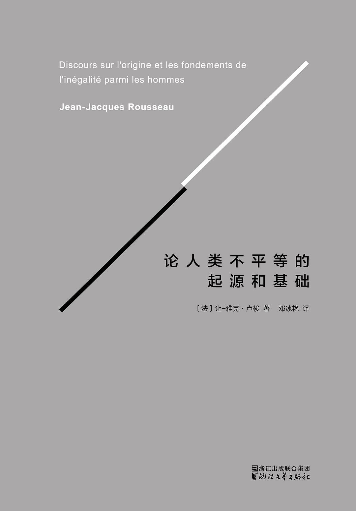

# 《论人类不平等的起源和基础》让-雅克·卢梭（法）

[TOC]

## 作者简介

> 让-雅克·卢梭（Jean-Jacques Rousseau， 1712年6月28日 - 1778年7月2日），发过十八世纪启蒙思想家、哲学家、教育家、文学家，民主政论家和浪漫主义文学流派的开创者，启蒙运动代表人物之一。
>
> 主要著作有《论人类不平等的起源和基础》、《社会契约论》、《爱弥儿》、《忏悔录》等。
>
> 卢梭出身于瑞士日内瓦的一贫苦家庭，当过学徒、仆役、私人秘书、乐谱抄写员。一生颠沛流离，倍历艰辛。1749年曾以《科学与艺术的进步是否有助敦化风俗》一文而闻名。
>
> 1762年因发表《社会契约论》、《爱弥儿》而遭法国当局的追捕，避局瑞士、普鲁士、英国，1778年在巴黎逝世。

## 内容简介

## 人物关系

## 摘抄与笔记

### 第1章 导读

> “我想那是1753年的事，第戎科学院发表了‘人类不平等的起源和基础’征文启事。我被这个意义深远的题目激动了，我很惊讶这个科学院竟敢提出这样一个题目。好吧，既然它有勇气提出来，我也很可以有勇气来加以研究，于是我报名应征了。”这便是卢梭在《忏悔录》中对此篇论文来源的叙述。为完成论文的写作，他独自前往圣日耳曼的树林深处，在经过七八天的苦思冥想后，完成了这部对后人影响深远的著作。

> 在同时代的作家中，卢梭是唯一富有流浪生活经验的人。他在历次旅程中，认识了人民的疾苦，对这个社会的不平等现象有了更加深刻的体会。或许正是出于这一原因，当他看到这个意义深远的征文题目时，他才会为之激动吧！

> 为思考人类不平等的起源，卢梭首先做的是“无情地驳斥人间无聊的谎言”，找到真正处于自然状态下的人类。

> 通过美妙绝伦的雄辩，卢梭为我们成功地勾勒出了真正处于自然状态下的野蛮人形象：“游荡在浩瀚森林里的野蛮人，没有工业，没有语言，没有住所，没有战争，彼此间也没有任何联系。他对同类没有任何需求，同时也没有任何伤害他们的欲望，而且可能一辈子不会单独认识任何一个其他同类。他不为情欲所牵绊，自给自足，只拥有这一状态下应有的情感与智慧。”

> 在这个形象里，所有理性、情欲以及人的一切能力的发展都被摒除在外，所有文明社会的产物，包括私有制和法律，都被拒之千里。那是一个纯粹的状态，这一状态的野蛮人唯一关心的是他们的“自我保存”，而他们与生俱来的“怜悯心”又会通过克制他们的“自爱”来促进整个物种的相互保存。在这个纯粹、孤独的野蛮人形象面前，传统的人类本性中的一切，差不多都已经被归为历史的范畴。任何一种社会制度，都不能在自然中找到它的基础了。

> “朝着镣铐的方向奔跑着，满心以为这样便可获得自由。”

> “我看到我的同类在他们因固执己见而走入的迷途上，还继续朝着错误、灾难和罪恶的方向行进。我于是用一种他们所不能听见的微弱声音，向他们喊道：‘你们都是毫无道理的人，你们不断地埋怨自然，要知道你们的一切痛苦，都来自你们自己。’”

> 事实上，卢梭所描述的处于自然状态下的人类更多是一种形而上的观念，是一种抽象化的物质。旅行家的日记和博物学家的分析，与其说可以当作此篇论文的论据，不如说只是为卢梭提供了想象出这样一个抽象状态的基础。那是对人类最初起源的形而上假设，是对现实的反潮流思考，是开启人类智慧的点金石。

> 本文为我们提供的反思就像那高速路上的缓冲带，只有停留在缓冲带上的那一秒钟，人类才终于真正地开始思考。

### 第2章 致辞：献给日内瓦共和国

> 如果要我选择自己的出生地，我会选择这样一个国家：它的大小一定不超过人们能力所及的范围，也就是说它是能够被很好地治理的。
>
> 在那里，每个人各司其职，没有任何一个人需要将自己所负担的职责委托给他人；在这样一个国家中，人民彼此间相互认识，所有邪恶的阴谋或者谦逊的道德都逃不过大众的眼睛和判断。在那里，这种互相往来和互相认识的美妙习惯，又会使人们将对国家的热爱转变成对公民的热爱，而不是对土地的热爱。

> 我想要生来自由，死亦自由。也就是说，人们如此服从法律，以至于无论是我还是其他任何人都无法撼动法律那值得尊敬的枷锁。这是一个温和而有益的枷锁，就算那些最骄傲的头颅，也无不温顺地佩戴着，因为他们生来就不应该佩戴任何其他的枷锁。

> 要知道，自由就像那美味的固体食物或者甘醇的葡萄酒，它们可能适合那些早就对此习以为常的健壮之躯，可以供他们使用或者使他们变得强壮，但是却并不适合那些柔弱、娇嫩之躯，根本无法让他们适应，只能让他们难受、毁灭或者沉醉。

> 人民一旦习惯主人的存在，便再也无法脱离他。当他们试图打开桎梏时，他们却与自由渐行渐远了，因为对于他们而言，自由不过是与桎梏相反的毫无节制的许可，而他们的革命最终几乎都将他们的命运交给了那些只会加重他们锁链的引诱者。

> 因此，对于我个人而言，我想要寻找一个幸福、安宁的共和国：它的年代已经消失在了时间长河的漫漫黑夜之中，它所遭遇的种种侵害足以彰显和加固居民的勇气和对祖国的热爱。那里的公民早就习惯明智的自由，他们不仅是自由的，而且是值得获得自由的。

> 我愿意为自己选择这样一个国家：它幸运地没有那么强大的力量，因而没有征服他国的野心，同时更幸运地拥有一个有利的地位，因而也不用害怕他国的征服。这是一个处于许多国家中间的自由城池，不仅没有任何一个邻国想要侵犯它，而且每一个邻国都会竭力阻止其他国家对它的入侵。总之，它是一个不但不会引起邻国的野心，而且在必要时能够合理地请求邻国帮助的共和国。

> 使法律变得神圣不可侵犯的正是其古老性。

> 我希望，很快地，人民会蔑视那些变化无常的法律，同时也会鄙夷这样一种人：他们习惯于以改良为借口忽视以往的惯例，在较正较小缺陷的同时，却反而引起更大的弊端。

> 在那里，政府官员的道德足以证明人民的智慧，官员和人民之间可以说是相得益彰。因此，当出现扰乱公共和谐的致命过失时，人们即使在忙乱与错误中，也都能保持一定的节制，依然互相尊敬，共同遵守法律。这才是一个真诚而又持久的和睦社会应该拥有的征兆和保证。

### 第3章 序

> **在我看来，所有人类知识中最有用却最不为人类了解的一点，就是对人类自己的认识。**我敢说，仅仅那些镌刻在德尔菲斯神庙上的铭文，就比所有那些论理学家的鸿篇巨制所蕴含的箴言显得更加重要，理解起来也更加困难。

> 我们如何在不了解人类的前提下去探讨人类的不平等？我们如何能够分清人类特征中哪些是其固有特征，哪些又是环境和进步在其原始状态基础上的增加或改变？
>
> 这就像那海神格劳克斯Glaucus的雕像：时间、大海和暴风雨使它失去了原有的模样，使海神的形象看起来不再像一个神，而是像一头凶猛的野兽。这正如那人类灵魂在社会中扭曲的面孔，由于不断发生的上千种原因，在接受诸多知识与谬误的过程中，在身体构造不断变化的过程中，以及在情欲的不断冲击下，它早已改变了原有的样子，变得让我们几乎难以辨认了。我们看到的已经不再是那些根据固定不变的准则行事的存在，不再是具有造物者赋予他们的卓越、崇高的简单的存在，而是自认为合理的情欲与处于错乱状态中的智慧的畸形对立。

> **更为不幸的是，正是人类取得的所有进步使其不断远离最初状态。**我们获得越多的新知识，就越无法获得理解最重要事情的途径。

##### 对人类不平等起源的大致阐述

> 这里存在着一个共识，即人类和其他所有物种一样，在最初状态下是平等的，直到不同的生理原因使一些物种发生一些可以被我们观察到的变化。
>
> 事实上，对于这些最初的变化而言，无论它们以何种方式发生，都不可能同时在一个物种的所有个体上产生相同程度的影响，而是会出现有的人在获得不同品质后变得完善或者堕落 —— 这些品质或好或坏，但都不属于他们的本性，而其他人则可以更长时间地保持在自然状态下的情况。
>
> 这便是人类不平等的最初起源，这样大致的阐述比精确地考察其真正的原因要来得简单。

##### 我们需要做的事情

> 我一开始做了些推论，然后尝试着做了一些推测，这样做的目的并不是想要解决这个问题，而是旨在将之阐明，呈现出其真实状态。
>
> 其他人可以轻易地沿着这条道路走得更远，但是没有一个人可以轻易地到达终点。
>
> 这是因为，我们要做的事情并不是只需要理清人类现在的特征中哪些是最初的特征，哪些是非自然的特征，也不是只需要很好地去理解一个现在已经不复存在，过去可能从未存在，将来也可能永远不会存在的状态，尽管有关这一状态的精确概念将有助于我们对现存状态的研究。

##### 我们需要解答的问题

> 为认识自然的人类，什么样的实验是必需的；
>
> 以及在社会中，进行这些实验的方式有哪些？

##### 人类的本性 vs. 自然法

> **正是对人类本性的无知使得我们对自然法的定义模糊不清。**

> 正如布拉马基所说：“法”的概念或者更确切地说“自然法”的概念，显然就是关于“人类本性”的概念。

##### 不同法学家对自然法则的理解

> 那些罗马的法学家们无情地将人类和其他所有动物毫无区别地置于相同的自然法之下，因为他们宁可把“自然法则”这一名词，理解为自然作用于自身的法则，而不是自然所规定的法则；
>
> 现代的法学家们却将“法则”这一词语理解为，对一个精神的存在，即一个具有理智和自由意志，而且在他与其他存在的关系中被尊重的一个存在所制定的规则。

##### 人类关于自然法的定义

> 既然我们对大自然的了解如此肤浅，而且对“法则”的理解存在如此大的分歧，我们便很难得出一个统一的关于自然法的定义。因此，对于所有那些我们在课本上找到的定义，它们的缺陷不仅体现在其定义的不统一上面，而且还在于它们是从人类并非天生拥有的知识以及人类只有离开自然状态后才可能产生的优势概念中提炼出来的。

> 人们往往先寻求一些能够促进公共利益而被大家共同认可的准则，然后将这些准则综合起来，便称之为自然法。这样做的唯一依据是，我们可以从这些准则的普遍实施中看到好处。毫无疑问，这是下定义的一种罪简便的方式，同时也可以说是以武断态度来解释事物性质的最简便的方法。

##### 关于自然法则需要明确的两点

> - 首先，为了可以称其为法则，必须使其规范对象的意愿有意识地服从这个法则；
> - 其次，这个法则必须是自然的，能够直接体现自然的声音。

##### 先于理性存在的两大原则

> - 其中一个原则让我们对自己的幸福和自我保存产生浓厚的兴趣；
> - 而另一个原则就是在看到所有感性存在尤其是同类死亡或者痛苦时会产生天然的反感情绪。
>
> 而我们的精神正在做的就是，在不需要引进人与人之间的关系准则的前提下，对这两个原则进行协调并且加以配合。
>
> 在我看来，**正是这两个原则的协调与配合催生了自然法的所有规则。**
>
> 随后，理性通过其不断的发展，终于达到了让本性窒息的程度，那时候，便不得不将这些规则建立在其他基础之上了。

> 因此，我们大可不必在将人类变成一个人之前先将他变成一个哲学家。他们并不仅仅因为后来出现的智慧和教训，才对别人存在义务。只要他不去抗拒怜悯心的自然冲动，他便永远不会对其他任何人，甚至是任何感性的存在作恶，除非是在他的自我保存受到威胁，他被迫优先考虑自己时，才会做出这样的正当举动。

##### 偶然的外部关系

> 当我们以一种平静、公正的眼光看待人类社会时，一开始它似乎只展现出了强者的暴力和对弱者的压迫。一些人精神反抗所遭受的严酷，让人们对另一些人的盲目感到惋惜。由于在人类中，没有任何东西比由偶然而不是智慧产生的外部关系来得更加不稳定，因此，乍一看，人类的组成似乎是建立在一片片移动的沙子的基础之上的。我们称这个外部关系为强或弱，富裕或贫穷。

> 只有当进一步观察，剥去围绕在建筑物周围的沙尘时，我们才能够瞥见这幢建筑物不可动摇的根基，才能够学会尊重它的基础。然而，如果没有对人类、人类的自然禀赋以及他的持续发展的深入研究，我们永远无法做出这些区分，永远无法在事物的现有组成中将神意的东西与人类艺术产生的东西分离开来。

##### 神让你做什么样的人?

> 当我们考虑到，如果任由我们自然发展，我们将会成为什么样子，我们就应该学会感激这个人：早在他用乐善好施之手改正我们的制度，并给予这一制度不可动摇的基础时，他便已经预测到了现行制度可能导致的骚乱，并用一些看起来似乎使我们遭遇无限苦难的方式，使幸福常与我们同在。

> **神让你做什么样的人？现在，你在人类中占据什么样的位置？对此，你应该有所思考。**

### 第4章 本论

> 我要讨论的是人，我所讨论的主题启示我将与人类对话。我总认为，惧怕敬重真理的人是不会提出这类问题的，所以，我站到了这里，在所有邀请我的智者面前，信心满满地为人类辩护。如果最后，我没有辜负这个主题和诸位评审员，我将非常高兴。

##### 人类中存在两种不平等

> - 自然的或是生理的不平等
>   - 这种不平等是自然造成的
>   - 主要体现在年龄、身体、体力、智力以及心灵方面
> - 精神的或是政治的不平等
>   - 这种不平等依靠一种公约
>   - 在人类共识的基础上被建立起来，或者至少为人类共识所认可
>   - 主要体现为少数人通过损害他人的利益而享有的各种特权
>   - 例如更加富有、更加富贵、更加强大，或者甚至让他人臣服

> 我们不必追问“自然的不平等”的源头，因为“自然的不平等”一词本身就是答案了。
>
> 我们更不必追问两种不平等之间是否存在实质性的联系，因为换句话说，这就相当于我们去追问发号施令的人是否一定优于服从的人，在同一人群中，人们的体力或智力、才能或品德是否总是与他们拥有的权力和财富相称。这样的问题适合那些被主人监听的奴隶去讨论，却并不适合那些追求真理的理性、自由的人。

##### 这篇论文具体是关于什么呢？

> - **首先，要指出在事物发展进程中，法律得以代替暴力、自然得以服从规律的转折性时刻；**
> - **其次，要解释通过怎样的一系列“奇迹”，才能使强者服务于弱者，使人民能够以牺牲真正幸福为代价，最终获取一种空想的安宁。**

> 所有研究过社会基础的哲学家都意识到了回归“自然状态”的重要性，却没有任何一个做到了这一点。

> 总之，那些不断地谈论着需求、贪婪、压迫、欲望和傲慢的人，其实是将他们从社会中获得的观点搬到了“自然状态”。他们讨论的是野蛮人，描绘的却是文明人。

> 宗教让我们相信：上帝刚把人类创造出来，就立即使他们摆脱了“自然状态”，而人与人之间之所以存在不平等，是因为这是上帝的意志。但是，宗教并没有禁止我们只根据人类及其周围事物的性质做出这样的猜测：如果任由人类自由发展，他们的命运将会如何？这正是我被问及的问题，也是我在此篇论文中将要探讨的主题。

> **所有来自大自然的东西都将是真实的。除非是因为我不小心掺杂了自己的意见。**

> 我总觉得存在着一个人类个体想要停留的时代，你将去寻找你希望整个人类停留的时代。当你不满于现状，而且对你可怜的后代将要面临的时代感到更加不满的时候，你可能会产生想要回到过去的愿望。这种想法应该会颂扬你的祖先，批判你们的同时代的人，并且使那些将在你们之后继续苟活的可怜的人感到震惊。

### 第5章 第一部分

> 尽管每种动物可能都有自己独特的优势，而人类却一无是处，但是人类懂得将所有属于其他物种的优势化为己有。

> 自然对待他们，就像是斯巴达的法律对待公民的孩子一样，它使那些生来体格健全的人变得更加强大与健壮，同时使所有其他人走向灭亡。

##### 野蛮人的优势

> 野蛮人的身体是他们拥有的唯一工具，他们将这一工具用于多种途径。然后，由于缺乏训练，如今我们的身体已经不具备这些用途了。正是我们的技能使得我们失去了野蛮人所必须掌握的力量与敏捷。

> 如果给文明人一些时间，让他们集齐周围所有的机器，那么毫无疑问，他们将轻易地战胜野蛮人；但是，如果您想看一场更加不公平的战斗，您可以试想文明人和野蛮人都处于赤身裸体、手无寸铁的状态，那么您就会明白野蛮人不断地积攒这些力量，时刻准备应付任何事情并且总是全身心地投入战斗的优势了。

> 在自然状态下，所有事物都以如此统一单调的方式运行着，大地并不会轻易受到任何由聚居人群的情欲和善变造成的突发性或持续性变化的影响。

> 此外，人类还拥有这样一个优势，即一方面在奔跑方面与其他动物同样精力充沛，另一方面又在树上找到了几乎能够保障安全的居所，从而在与敌人狭路相逢时能够做到进退自如，可以自由地选择是逃跑还是战斗。

> 还有另外一种更加可怕的敌人，在这个敌人面前，人类将无处遁形。这个敌人就是：幼弱、衰老和各种疾病等天然缺陷。在这些象征着人类弱点的悲哀符号中，前两者是所有动物所共有的，而后者则主要属于生活在社会中的人类。

##### 思考的状态是一种反自然的状态

> 生活方式的极度不平等导致有的人悠闲过度，而有的人却劳累不已；我们的食欲和性欲都太过容易地被刺激着和满足着；富人家的食物过于精致，他们只摄入增加热量的精华部分，从而减弱了自身的消化功能，而穷人家只能吃粗茶淡饭，而且经常食不果腹，因此一有机会他们便不免贪吃，从而加重了肠胃的负担。彻夜不眠以及种种过度行为；各种情欲的放纵、身体的疲惫以及精神的衰竭；所有状态下的人类都感受到了无尽的忧伤与痛苦，他们的灵魂也因此被无休止地侵蚀着。

> 于是，我们得出令人无比沮丧的结论：我们所经历的大多数苦难都是我们咎由自取的结果，同时，如果我们能够维持自然赋予我们的简朴、单纯、孤单的生活方式，我们本可以避免所有这些苦难。

> 如果自然赋予我们的是健康，那么我几乎可以确定：**思考的状态是一种反自然的状态，而进行思考的人类则是堕落的动物。**

（这里让我想到了陶渊明的诗句：“就在樊笼里，复得返自然。”）

[归园田居（其一）](https://hanyu.baidu.com/shici/detail?pid=7e12d9a73b7a45b9a604048db198bc7f&from=kg0&highlight=%E4%B9%85%E5%9C%A8%E6%A8%8A%E7%AC%BC%E9%87%8C%EF%BC%8C%E5%A4%8D%E5%BE%97%E8%BF%94%E8%87%AA%E7%84%B6)

> 最后，无论精良的医术对我们而言有多么地重要，我们总可以断言，虽然野蛮人在受伤时孤立无援，只能依靠自然，但是另一方面，他也只需要为自身的这一损伤担忧。这样说来，他的处境似乎要好过我们。

##### 在群居与奴隶化的过程中，人类显著退化

> 自然对所有处于自己看管下的动物有着特殊的眷顾，这份偏爱似乎在向世人展示自然是如何地珍视自己对这些动物的看管权。无论是马、猫、牛还是驴，生活在丛林中的它们总是比被圈养在家中的它们体格更加强健，精力更加充沛，力量和勇气更加旺盛。它们一旦变成圈养动物，所有这些优势就会丢失大半。
>
> **可以说，我们对这些动物所有的照顾与喂养都只会让它们退化。**人类又何尝不是如此：**在群居与奴隶化的过程中，他逐渐变得虚弱、胆小、卑躬屈膝，安乐而又萎靡的生活方式使他不再充满力量与勇气。**

> 因此，就算原始人赤裸着身子，居无定所，缺乏所有那些我们认为必不可少实则无用的东西，他们的处境也并没有那么地糟糕，他们的自我保存更不会受到多大的妨碍。

> 最后，除非假设遇到我在下面所要谈的那些独特而又偶然的情况，否则我们就有理由认为：第一个为自己做衣服、建房子的人，实际上不过是为自己创造了些很不必要的东西。因为之前在没有这些东西的情况下，他照样活得好好的，我们很难明白为什么在长大后反而不能忍受他从小就能忍受的那种生活。

##### 从形而上和道德的角度探讨人类

> 在我看来，所有动物不过是一部部精密的机器，大自然赋予这部机器感官，让它能够自行恢复，并且在某种程度上对一切企图毁灭它或者干扰它的东西实行自卫。在人体这部机器中，我恰好看到了相同的东西，但存在这样一个区别：兽类的活动是完全由自然主宰的，而人类则可以作为一个自由的主体参与其本身的动作，即一个是靠本能进行取舍，而另一个则是靠自由行动进行选择。
>
> 正因如此，兽类永远无法摆脱自然加在它身上的规则，即使有时这样对它非常有利；而人类却经常远离规则，即使有时这会对他产生危害。这就是为什么，一只鸽子即使待在盛满最可口鲜肉的盆子旁也有可能被饿死，而一只猫即使待在一大堆水果或谷物旁也有可能因缺乏食物而丧命。事实上，无论是鸽子还是猫，如果它们勇于尝试，它们完全可以以那些它们所鄙夷的食物为食。
>
> 人类就是这样坠入了过度行为的深渊，从而给自己招致了发烧和死亡。要知道，精神使感官堕落，而当自然的需求已经得到满足时，意志却还会提出要求。

##### 一个人与另一个人之间的差距比一个人与一个兽类之间的差距还要大

> 在所有动物中，将人区别开来的主要特点并不是人类的理解力，而是人类作为自由主体的特征。
>
> 自然支配着一切动物，而兽类总是选择服从。人类本来面临着同样的压力，但他自认为有选择顺从或者反抗的自由。正是因为人类意识到了这一自由，其灵魂的精神性才得以体现。
>
> 因为即使物理学可以在一定程度上解释感官的机制以及观念的形成，但是在意志或者选择的力量方面，以及对这一力量的感知中，我们只能发现一些纯精神层面的行为，而这些行为是机械规律所无法解释的。

###### 自我完善的能力

> 这一能力可以借助于环境的影响，持续不断地促进其他所有能力的发展，而且这种能力不仅存在于人类个体身上，而且还存在于整个人类物种之中。至于动物个体，它们往往在短短的几个月内就完成了对整个生命的体验，而整个物种在上千年后也不会有任何改变。
>
> 为什么只有人类才易于变得愚蠢？难道不是因为人类有回到原始状态的风险，而兽类在整个过程中既无所得，也无所失，因而一直活在自己的本能中吗？而人类由于衰老或其他事故而失去所有那些通过“自我完善”获得的能力时，他的处境难道不比兽类更差吗？
>
> 当我们被迫承认：这一卓越的、几乎无限的能力却是人类所有苦痛的来源；正是这一能力在时间的长流中将人类从原始状态中拖拽出来，使他不能再过上安静、单纯的生活；正是这一能力在几个世纪中为人类孵化了所有的理智与错误、所有的罪恶与道德，久而久之，将人类变成了统治自己与大自然的暴君，这对我们而言，该是多么可悲啊！

> 无论论理学家们作何论述，他们必须承认人类的智力在很大程度上来源于他们的情欲，而他们的情欲也以同样的方式受到他们智力的促进：正是在情欲的不断释放中，我们的理性得到了完善；我们之所以有认知的欲望，是因为我们想要享受。我们无法想象一个既没有欲望又没有恐惧的人却费尽心思地推理。**而情欲的源头则是我们的需求，促进其发展的是我们的认知。**

> 这是因为，当一个人想要或者惧怕一个事物时，要么是因为他产生了“不能得到”的念头，要么就是因为大自然的简单驱使。野蛮人没有受到任何理性光芒的照耀，因此他只能体会到由各种自然冲动产生的情欲⒒；他的欲望不会超越身体上的需求；在这个世上，他能够认知的唯一的“好”就是粮食、雌性和休息，而他惧怕的唯一的“恶”就是疼痛和饥饿。这里我说的是疼痛，而不是死亡。因为对死亡以及与之相伴的恐惧的认知是人类摆脱动物状态所获得的最初的认知。

> 我还注意到，一般情况下，北方民族比南方民族更加灵巧，因为他们必须这样，似乎这是大自然的安排，让那些头脑更聪明的人无法享受肥沃的土地，以示公平。

###### 语言在起源过程中所遇到的障碍

> 我们遇到的第一个困难就是：要知道人类对语言的创造是如何变得迫不及待的。因为在人类相互间没有任何联系，而且也没有任何必要进行联系的情况下，语言并不是不可或缺的，这使我们无法想象这一创造的必要性及可能性。

> 那么接下来需要探讨的就是语言是如何形成的。我们会发现，这一困难比前一个困难更加艰巨，因为如果说人类需要语言来学会思考，那么他们更需要知道如何思考来发现语言这门艺术。而且，纵然我们能够理解声音的回响是如何被用作交换我们观念的约定工具的，我们仍然需要进一步探讨，当初对于那些不以感性实体为载体，因而既不能通过手势，也不能通过声音表达出来的观念，又将约定以什么样的工具来传播呢？

> 人们的知识越是有限，他们所使用的词汇就越庞杂。

> 当你试着描绘一般概念的树的形象时，你会发现你根本永远无法做到：无论你愿意与否，你得知道这棵树是高是矮，是光秃秃的还是枝繁叶茂，是浅色的还是深色的，你还必须判断你所看到的特征是否为一般概念的树所拥有。这样一来，你所描绘出来的形象将不再是树的模样。纯抽象的存在亦是如此，它只能通过言辞（disc·urs）进行表达。

> 三角形的定义便可以给予你关于三角形的真实概念：当你在脑海里想象出一个三角形时，如果你希望这是一个特定的三角形，而不是另外一个三角形时，你将不可避免地需要对这个三角形的三边或是面进行描述。而要进行描述，你就必须发出句子。因此，要想形成一般概念，我们必须言语（parler），因为一旦想象中止，精神只有借助于言辞才能继续前行。

### 第6章 第二部分

### 第7章 注释

### 第8章 卢梭致菲洛普利的信

### 第9章 卢梭生平大事年表

## 相关名词

[托马斯·霍布斯](https://baike.baidu.com/item/%E6%89%98%E9%A9%AC%E6%96%AF%C2%B7%E9%9C%8D%E5%B8%83%E6%96%AF/3086013?fromtitle=%E9%9C%8D%E5%B8%83%E6%96%AF&fromid=649408&fr=aladdin)

[第戎科学院](https://www.zhihu.com/question/264959855)

[形而上](https://baike.baidu.com/item/%E5%BD%A2%E8%80%8C%E4%B8%8A/65485?fr=aladdin)

[自然法](https://baike.baidu.com/item/%E8%87%AA%E7%84%B6%E6%B3%95/1460505?fr=aladdin)

[自我保存](https://baike.baidu.com/item/%E8%87%AA%E6%88%91%E4%BF%9D%E5%AD%98/8679892?fr=aladdin)

