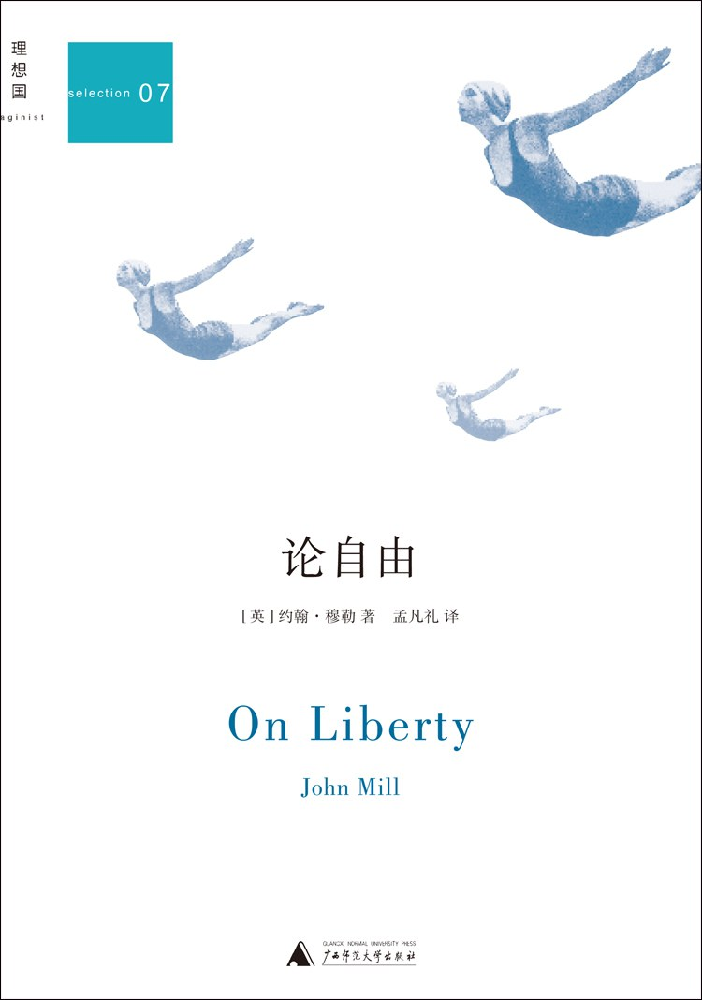

# 《论自由》约翰·穆勒（英）

[TOC]

## 作者简介

## 内容简介

## 摘抄与笔记

### 第1章 导读：为什么我们今天依然还要读穆勒？

###### 西方十七、十八直到十九世纪的思想家

> 马基雅维利
>
> 博丹
>
> 格劳秀斯
>
> 霍布斯
>
> 洛克
>
> 卢梭
>
> 伏尔泰
>
> 孟德斯鸠
>
> 亚当·斯密
>
> 边沁
>
> 约翰·穆勒

###### 西方现代性的历史演变的两个阶段

> - 早期现代
> - 中晚期现代
>
> 以约翰·穆勒为代表的十九世纪的英国思想家们，恰巧是处于从早期现代到成熟的西方现代文明的转折十七。
>
> 穆勒的思想为英国乃至欧洲社会从早期现代向现代社会的迈进，提供了一个承上启下的典范性的理论依据，他的政治哲学、政治经济学和伦理学著作，尤其是在当时的英国乃至日后在世界影响深远的这篇名为《论自由》的小册子，均是应对西方社会的这个时代之转型问题，勾画未来社会的健康发展。

> 击水中流，匡正时弊，发前人之所未发，穆勒蔚然开辟出西方现代社会思想中的一大理论路径。

> 中国在这个时间段面临的问题，从大的方面说，在我看来恰恰很类似于约翰·穆勒所处的英国社会从早期现代向成熟现代迈进的转型时期，我们迫切需要约翰·穆勒那样的承前启后的思想家，为这个极其复杂的转型时代提供切中肯綮的思想理论资源。

###### 洛克《政府论》vs. 穆勒《论自由》

> 穆勒的《论自由》，不失为一个十九世纪版本的洛克《政府论》。

> 在洛克的《政府论》中有两层逻辑：
>
> - 一层逻辑是构建政府
> - 另外一层逻辑是彰显个人权利
>
> 洛克的真正企图是通过构建一个具有人民授权的合法而有限的政府，以此强化个人权利的重要价值，即它们是政府权力的正当性来源。
>
> 所以，洛克的《政府论》又可以视之为权利论或自由论，right在洛克的语境中实质上就是一种绝对的自由，即自然权利论的自由。

> 穆勒的这本名为《论自由》的十九世纪之新版“政府论”，从表面上看与洛克恰恰是相反的，《论自由》的大部分篇幅讨论的都是个人思想言论自由以及个性自由的重要性。
>
> 在我看来，穆勒看上去在滔滔不绝地谈自由，但其核心思想和隐含的重要目的实际上是在论政府，在于限制政府以及与政府相关联的“多数的暴政”。

> - 洛克 - 激进主义 - 积极自由主义的色彩
>   - 谈的是构建政府
>   - 核心却是保卫权利
> - 穆勒 - 保守自由主义 - 消极自由观念
>   - 谈的是捍卫自由
>   - 核心却是限制政府
>
> 这样，穆勒就从与洛克相反的逻辑方向上，深化乃至完善了**洛克的“政府—权利”学说**，形成了一种**新的“自由—社会”学说**，大大丰富了自由主义思想的理论内涵与解释力度，更重要的是更好地因应了时代问题——限制政府权力，哪怕是具备基于权利论的正当性基础的政府亦不例外。

###### 群己权界 —— 严复

> 严复将穆勒的“自由”（liberty）翻译为“群己权界”，是以中国自己的语言非常准确且实质性地把自由的精义表现出来了。

> 英文的liberty一词，作为现代社会的核心意涵，关涉个人与他人尤其是个人与社会的关系，或者说关涉个人与“群”的权利（及权力）边界问题。

> 两人以上就形成了群，群即社会，有了社会，就有了社会的power（权力），政治也就出现了。
>
> 所谓的“群己权界”指的就是right与power之间的rule（规则）问题，这个群己权界就构成了自由的核心原则：一个社会的权力应该是一种基于规则的（具有正当性来源的）权力，其要义是通过划分政府权界，尊重并保障每个个体之人的right。

###### 否定性自由

> 穆勒的这个自由论显然是一种典型的否定性自由的论证：免于……强制的自由。由此，我们可以说，穆勒从思想史上拓展了自由的内涵，liberty在他那里，不再仅仅等同于right，甚至也不仅仅是复数的rights，他的自由概念要比权利概念包含更多的内容。
>
> 在群己权界的范围内，每个人都有自由活动的空间，自由是否定性的，消极意义上的自由，这与洛克自然权利论意义上的积极自由是不同的，是洛克之后更深入的自由概念的发展。

###### 当今中国

> 这次通读了凡礼君新译的《论自由》后，我的有关早期现代之于中国的想法得到了进一步深化：**在一个基本权利问题未得根本解决的社会情况下，如何捍卫已经凸显出来的个人自由，尤其是思想言论的自由，从而保持这个民族的生命力，为个人自由留出向纵深拓展的足够的社会空间**（这些东西正是穆勒所揭示出来的不同于洛克right的liberty的核心意涵所在）？
>
> 在穆勒看来，最关键的就是限制政府权力，划定它的界限，他反对政府乃至社会的舆论一律，要求尊重个性自由，反对政府垄断工业、垄断人才（即使是通过全面公平的公务员考试遴选制度）。反观中国，穆勒所指陈的那些问题正可说是触目惊心，权力边界问题、政府垄断问题、言论空间问题……诉诸我们亲身的所见所感，比之十九世纪的英国，情况何其严重乃尔！

> 一部真正伟大的著作，所谓的经典，固然是源于作者生存时代与地域的问题激发，但其思想价值完全可以超越它的时代和它的地域，而具有某种程度的普遍性或普世性意义。

> 作为读者，我们依然有必要读洛克，读穆勒，因为他们的著作不仅仅是学问之作，而是思想之作，不仅仅是历史之作，而是现实之作。他们提出的问题与当今中国人的自由生活密切相关，他们就是写给我们读的，说给我们听的。一个能够思考自由与政府的民族才可能成为一个真正成熟的政治民族。所以，朋友们，读书吧。

> 本书所展开的每一个论证，都直接指向一个总体的首要原则：人类最为丰富的多样性发展，有着绝对而根本的重要性。

### 第2章 献词

> 她的伟大思想和高贵情感已随她深埋地下，如果我有能力将其向世人说出一半，我宁愿做一个中介者，比之我未经她启发和帮助所能写的任何东西，她那几乎无可匹敌的智慧都更有益于人类。

### 第3章 引论

###### 这篇论文的主题

> 这篇论文的主题，不是所谓的意志自由（即那个与被误称为“哲学必然性”的信条不巧恰相对立的东西），而是公民自由或曰社会自由，也就是社会所能合法施加于个人的权力的性质和限度。

###### 自由与权威之间的斗争

> 统治者不管是一个大权在握的个人，还是实际掌握统治权的某个部族或等级，其统治权威不管是得自于继承，还是来自于征服，无论如何，其掌握权力不是出自被统治者的意愿。人们不敢甚至不想对统治者的至上权威提出异议，充其量只是采取各种措施戒备暴政的实施而已。统治者的权力被认为是必要的，但也是高度危险的，因为作为武器它不仅可以用来抵御外敌，还会被用来对付其臣民。

> 这就好比在一个群体中，为了保护更为弱小者免遭无数秃鹰捕食，有必要由一个比其余者都更强的鹰王受命进行统御。但是这个鹰王对群体的戕害实不亚于那些小一号的贪婪者，于是群体又不得不对鹰王的尖嘴利爪时刻加以提防。因此，爱国者的目标就是，在必须容忍统治者向群体施用权力的同时，为之设置某些限制，这些限制就是他们所谓的自由。

###### 可用的限权之法

> 1. 让某些可称之为政治自由或政治权利的豁免权获得认可，统治者若侵犯这些自由或权利即被视为无道，一旦其真的有所侵犯，人们的个别抵制或普遍抗争就被认为是正当的。
> 2. 宪政制衡的确立，使得统治权力某些重要措施的实施，要以得到群体或被认为是代表群体利益的某种团队的同意为必要条件。

###### 从限制权力本身到选举短任统治者

> 但是，人类事务已进步到这样一个时代，人们对于统治者应该成为独立的权力而与人们自身利益相对立，已经不再认为有本质上的必要了。如果能让国家的各级官吏成为人们的承租人或代理人，可以随他们的意愿而撤换，看起来要好得多。似乎只有用这种方式，他们才能获得完全的保障，使得政府权力永远不会被滥用而损害他们的利益。凡有平民政党存在的地方，这种选举短任统治者的新要求，都逐渐成为他们寻求的重要目标，并且在相当程度上取代了此前寻求限制统治者权力的努力。

###### 所谓的“自治政府”并不能反映事情的真实状态

> 然而，当一个幅员广阔的民主共和国最终雄踞地表，并且被视为世界民族之林最强大的成员之一时，民选的责任政府作为一个重大的既存事实，就成为观察和批评的对象。人们开始察觉所谓的“自治政府”与“人民自我治理权”等名词并不能反映事情的真实状态。行使权力的“人民”和权力所施对象的人民并不总是同一的；所谓的“自治政府”也不是每个人自己治理自己的政府，而是每个人受所有其他人治理的政府。

> 而且，**人民的意志实际上只是大多数人的意志，或者是人民中最活跃的一部分人的意志；而所谓大多数又或者只是使他们自己成功地被接受为大多数的那些人而已；结果就是，人们也会要求压迫总体中的一部分人。**

###### 多数者暴政

> 在政治思想中，现在一般已把“多数者暴政”（见托克维尔：《论美国的民主》[De la Démocratia enAmérique]，第2卷，第142页。——原编者注；参见中译本《论美国的民主》，上卷，董果良译，商务印书馆，1988年，第287页。——译者注）看作是社会应该有所戒备的祸患之一了。

> 人们最初认为并且仍然庸俗地认为，多数者暴政之所以像其他暴政一样可怕，主要是因为它是通过公共权力的措施来施行的。但是深思之士已经察觉到，当社会本身就是暴君时，即当社会集体凌驾于组成它的各别个体之上时，暴政的实施就并不限于借助政治机构之手而行的各种措施。社会能够并且确实在执行自己的命令，而如果它执行了错误而非正确的命令，或者对它根本不应干涉的事务发号施令，那么它便是实行了一种比其他各种政治压迫更为可怕的社会暴政，它虽然不常以严厉的惩罚为支撑，但却由于更深入地渗透到了人们生活的细节之中，甚至束缚了人们的心灵本身，从而使人们更加无法逃脱。

> 因此，仅仅防范各级官府的暴政是不够的，还需防范优势意见和大众情感的暴政，防范社会即便不用民事惩罚，也能有法将自己的观念和做法作为行为准则强加于异见者的趋势，防范社会束缚与自己不相一致的个性的发展，甚至有可能遏止其形成，从而使所有人都必须按照社会自身的模式来塑造自己的那种倾向。

> 集体意见对于个人独立的合法干涉是有一个限度的。发现这一限度并维护其不受侵蚀，对于使人类事务进至良善之境来说，正像防范政治上的专制一样，是不可或缺的。

###### 行为准则

> 首先必须要由法律规定一些行为准则，并且在那些尚不适合由法律规范的事情上，还要让社会舆论去裁夺。

> 没有两个时代，也很少有两个国家对此有相同的规定，一个时代或国家的规定在另一个时代或国家看来也许会颇感诧异。
>
> 可是任何一个特定时代与国家的人们，对此又好像从未觉得有何疑难，仿佛它是一个人类从来就见解一致的问题。
>
> **人们把从自身生活中得来的规则视为不证自明和理所当然。**

> 人们关于人类行为规范的意见，实际的指导原则乃是每个人心中都有的这样一种感情，即他和他的同道者希望人们怎么做，人人就该怎么做。

> 无论哪一国家，只要存在着一个上流阶级，这个国家的道德原则大部分就会源自这一上流阶级的阶级利益和阶级优越感。

> 另一方面，若是从前的上流阶级丧失了其支配地位，或支配地位不再受欢迎，风行的道德准则常常就会表现出对那种优越的无比反感。

> 在众多更为基础性的影响力量之中，普遍而明显的社会关切，在道德情操的走向上当然起着一份而且是很大一份的作用，但是这与其说是出于理性或社会关切自身，不如说是从中产生的同情或反感的结果，同情或反感对社会关切几乎没有什么影响，但在道德情操的确立上却有着十分重大的作用。

> 社会的好恶，或社会中强势群体的好恶，就这样成为实际决定社会规则的主要依据；而这些规则要求人们普遍遵守，否则就要施以法律或舆论惩罚。

> 而且一般说来，那些在思想和感觉方面都走在社会前面的人，也未从原则上对这种情形提出批评，尽管在某些细节方面会和它发生冲突。他们更愿意过问社会的好恶应该是什么，而不去追问何以社会的好恶应该成为个人必须遵守的律条。他们宁可在自己就是异见者的某一具体点上尽力去改变人们的看法，而不愿联合所有异见者同心协力来捍卫自由。

### 第4章 论思想言论自由

### 第5章 论作为幸福因素之一的个性自由

### 第6章 论社会权力之于个人的限度

### 第7章 论自由原则的应用

